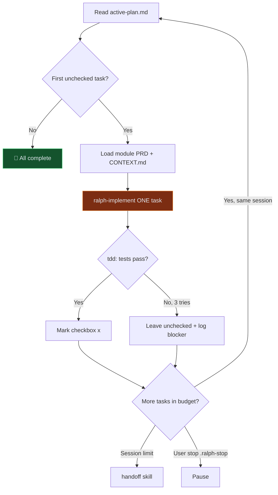

# PRD Build Loop

> **Trigger:** User has **finalized** modular PRD under `docs/prd/` and wants all tasks implemented autonomously.

Orchestrates: `setup-matt-pocock-skills` → PRD→Plan → `ralph-implement` × N → done.

---

## Phase 0 — Preconditions

Verify before starting:

| Check | Path / Action |
| ----- | ------------- |
| Macro PRD exists | `docs/prd/00-macro-shared.md` |
| Module PRDs exist | `docs/prd/modules/M*.md` |
| User confirmed finalized | Ask once if not stated |
| Git clean or committed | Recommend commit before loop |

If missing, **STOP** and tell user to finish PRD first.

---

## Phase 1 — Bootstrap (first run only)

Skip any step whose outputs already exist.

### 1.1 Project setup

If `docs/agents/issue-tracker.md` missing → run **`setup-matt-pocock-skills`** logic:
- Issue tracker: **local markdown** → `.scratch/issues/`
- Triage labels: default five canonical roles
- Domain docs: `CONTEXT.md` + `docs/adr/`

### 1.2 Ralph scaffold

If `specs/implementation-plans/` missing → run **`ralph-init`** logic:
- Create `specs/`, `prompts/`, `ralph.sh`, `test-wrapper.sh`
- Create `.ralph-security` (confirm local Windows + Docker blast radius with user)
- Seed `specs/README.md` Pin from `docs/prd/00-macro-shared.md` module list

### 1.3 Domain glossary seed

If `CONTEXT.md` missing, create from PRD entities:
- Objective, Lead, Worker, ControlLoop, Handoff, Department, Proof, Transcript, Sidecar, Sandbox

---

## Phase 2 — PRD → Implementation Plan

**Only run if** `specs/implementation-plans/active-plan.md` missing OR user says `regenerate plan`.

### 2.1 Read development order

From `docs/prd/README.md` → Recommended development order (Phase 0→3).

### 2.2 Generate tasks

For each module in order, read `docs/prd/modules/M*.md` and emit **vertical slice** checkboxes:

```markdown
# Active Plan — Operon
# Generated from docs/prd/ — do not edit checkboxes manually during loop

## Phase 0 — Platform
- [ ] M12: Tauri 2 desktop shell scaffold with system tray
- [ ] M12: Sidecar health check API on localhost
- [ ] M09: SQLite schema for Company, Objective, Department
...

## Phase 1 — Core loop
- [ ] M11: LLM router stub with model config
...
```

Rules:
- One checkbox = **one** `ralph-implement` iteration (2–4 hours max scope)
- Reference module PRD path in task text
- Follow Phase order from README
- Use domain terms from `CONTEXT.md`
- **Do not** create horizontal tasks ("write all tests")

### 2.3 Update Pin

Append each module to `specs/README.md` with keywords from PRD module names + entities.

### 2.4 Optional issues

Run **`to-issues`** to mirror plan into `.scratch/issues/` (for tracking, not source of truth during loop).

**Source of truth for loop progress:** checkbox state in `active-plan.md`.

---

## Phase 1.5 — New Phase Gate（Phase N+1 必过）

**When:** User asks for Phase 5+ / `parseN` / new roadmap after prior phase complete.

**Order is mandatory:**

1. **PRD delta first** — update `docs/prd/00-macro-shared.md`, `docs/prd/README.md`, and every affected `docs/prd/modules/M*.md`:
   - New scope in §2.1 boundary table
   - Interface contracts (paths, async, entities)
   - **实现状态** rows marked `📋 计划` (not ✅ until code lands)
   - Revision record bumped
2. **Plan second** — append `specs/implementation-plans/active-plan.md` §Phase N from PRD (not from code exploration)
3. **Confirm third** — present PRD diff summary; **wait for user approval** before any implementation
4. **Build fourth** — `continue` / loop as usual; after each task, flip PRD 实现状态 ✅ where applicable

**Resume / `continue all` on a new phase without step 1–3:** **STOP** and say: 「请先完成 PRD 增量与用户确认，再实现。」

See also: `docs/prd/README.md` §新阶段扩展流程.

---

## Phase 3 — Autonomous Build Loop



### Loop rules

1. **ONE task per iteration** — same discipline as `ralph-implement`
2. **Always use `tdd`** for implementation tasks
3. **Read only:** Pin, active-plan, current task's module PRD, files you touch
4. **Max 3 test-fix attempts** per task; then leave `[ ]` and note in `.ralph-logs/`
5. **Session budget:** max **5 tasks** per Agent session, then run **`handoff`** with suggested skill `prd-build-loop`
6. **Stop file:** if `.ralph-stop` exists, finish current task and exit
7. **Commit** after each completed task (if git repo): `git add -A && git commit -m "ralph: [task summary]"`

### Per-task log

Append to `.ralph-logs/session.log`:

```
[ISO8601] TASK_START | M12: Tauri scaffold
[ISO8601] TASK_DONE  | files: apps/desktop/...
[ISO8601] TASK_FAIL  | reason: ...
```

---

## Phase 4 — Completion

When no `- [ ]` remain:

1. Run full test suite
2. Update `specs/current-state.md`
3. Summary: tasks done, files changed, blockers left
4. Suggest **`improve-codebase-architecture`** if installed

---

## Resume command

New chat after handoff:

```
/prd-build-loop continue
```

Agent reads `active-plan.md`, `.ralph-logs/session.log`, handoff doc, continues from first `[ ]`.

**New phase** (first unchecked block is Phase N where PRD has no matching §):

```
/prd-build-loop parseN
```

→ Run **Phase 1.5** (PRD delta → plan → user confirm) **before** marking tasks or writing code.

---

## Anti-patterns

- ❌ Implement without finalized PRD
- ❌ **Start a new Phase (N+1) in code before PRD + active-plan are updated and user confirmed** (Phase 5 lesson)
- ❌ Skip checkboxes / work off memory
- ❌ Multiple tasks in one iteration without marking each
- ❌ Read entire `docs/prd/` every iteration (read one module PRD only)
- ❌ Continue after 3 test failures without logging

---

## Skill composition map

| Phase | Skills invoked |
| ----- | -------------- |
| Bootstrap | setup-matt-pocock-skills, ralph-init, domain-modeling |
| Plan | to-issues (optional) |
| Build | ralph-implement, tdd |
| Pause | handoff |
| Outer | ralph-loop (bash harness) |

---

## User invocation

```
/prd-build-loop
```

With finalized PRD. First run: bootstrap + generate plan + start loop.
Subsequent: `continue` or re-invoke to pick up next tasks.
