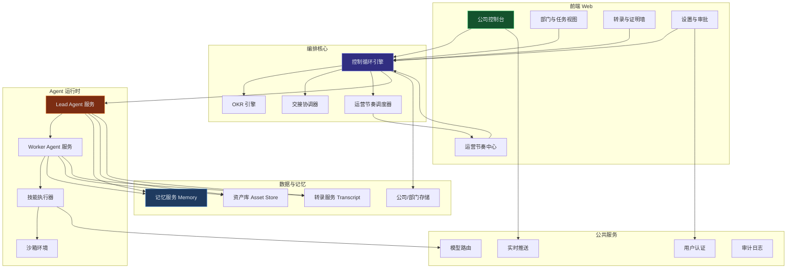
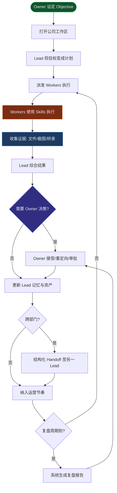
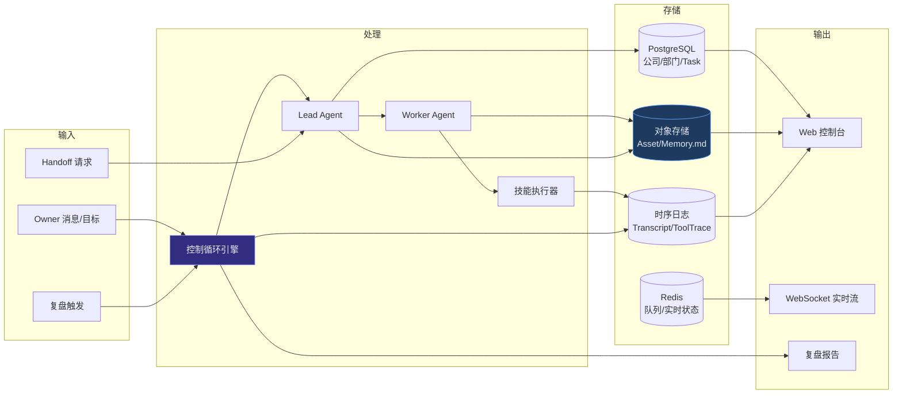
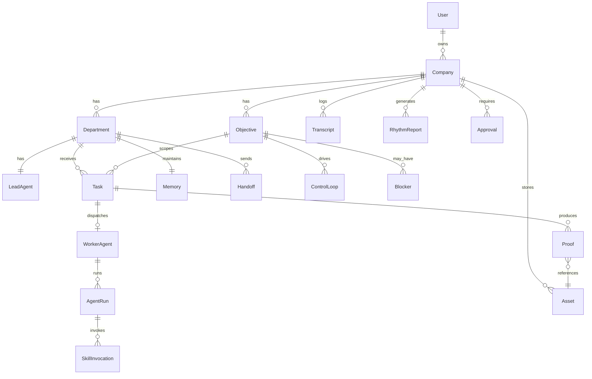

# Matrix Web 版 PRD（AI 辅助编程版）

> ⚠️ **已废弃**：本单体 PRD 已被模块化 PRD 取代。  
> 请使用 **[docs/prd/README.md](./prd/README.md)** — Windows 优先跨平台桌面版，按模块拆分。

> 基于 [Matrix 用户指南](https://matrix.build/zh/guide) 与 [Matrix 官网](https://matrix.build/zh) 逆向提炼，面向网页版「0 人 Agent 公司」平台实现。

---

## 文档信息

| 项目 | 内容 |
| ---- | ---- |
| 项目名称 | Matrix Web — 0 人 Agent 公司运营平台 |
| 文档版本 | v0.1 |
| 产品负责人 | [待确认] |
| 编写日期 | 2026-07-04 |
| 审核人 | [待确认] |
| 需求来源 | https://matrix.build/zh/guide |

---

## 修订记录

| 版本 | 日期 | 修改人 | 修改内容 | 审核人 |
| ---- | ---- | ------ | -------- | ------ |
| v0.1 | 2026-07-04 | AI | 基于用户手册初稿，含宏观+中观+微观全章 | [待确认] |

---

## 一、业务背景

### 1.1 业务现状

传统 AI 助手（ChatGPT、Claude 等）以**单轮对话**为核心交互：用户逐步下指令，AI 回答后上下文容易膨胀，缺乏部门边界、持久记忆、工作证明和跨会话连续性。创业者若要用 AI 完成「从目标到收入」的完整商业闭环，需要自行串联研究、工程、增长、收款等环节，运营成本高、结果不可验证。

Matrix 桌面版已验证「0 人 Agent 公司」产品模型：Owner 设定方向，Lead 持久记忆并规划，Worker 聚焦执行并返回证明，System 维持排程与交接节奏。官网声明 **Web 版即将推出（Web app coming soon）**，网页版需复刻该运营模型，让用户在浏览器中经营一家可自主运转的 Agent 公司。

### 1.2 业务目标

1. 在 Web 端完整实现 Matrix 指南定义的**八种运营循环**（公司模型、控制循环、部门、记忆、技能、资产、协调、运营节奏）。
2. 支持 Owner 以「目标 + 复盘节奏」驱动公司，而非空白 prompt 框。
3. 实现 Lead/Worker 分层执行、转录审计、证明收口，达到「可信自动化」而非「需要 babysit 的自动化」。
4. 为后续商业原语（网站部署、Stripe 收款等）预留扩展接口。[待确认：MVP 是否包含收款]

### 1.3 预期收益

| 收益维度 | 预期 |
| -------- | ---- |
| 用户价值 | 设定一个真实目标后，多部门 Agent 长期自主推进，Owner 仅需战略决策与审批 |
| 效率提升 | 相比单线程 AI 聊天，部门边界使上下文更小、决策更清晰、Worker 失败不污染 Lead 记忆 |
| 可验证性 | 所有工作以文件、测试、截图、转录为证明，对话不是最终产物 |
| 商业潜力 | 支撑 VPTD（价值/Token 成本）度量，为按用量计费或订阅模式奠基 |

---

## 二、功能范围

### 2.1 功能边界

| 范围 | 包含功能 | 不包含功能 |
| ---- | -------- | ---------- |
| **本次需求（MVP）** | 公司工作区、Objective 管理、部门与 Lead/Worker 模型、控制循环、记忆系统、技能派发、资产管理、跨部门交接、转录审计、运营节奏（日复盘/周复盘）、Owner 审批、实时执行流展示 | 原生 macOS 电脑控制、Neo Intelligence 自研 Harness、Agent Wallet 完整支付审批流 |
| **本次需求（P1）** | OKR 拆解视图、多模型路由配置、子域名部署、证明墙 | 自定义域名 SSL 全自动 |
| **后续规划（P2）** | Stripe 收款、Agent 邮箱、VPTD 记分牌、Agent 市场/技能商店 | 企业多租户 SSO、等保认证 |

### 2.2 功能优先级

| 优先级 | 功能项 | 说明 |
| ------ | ------ | ---- |
| **P0** | 公司工作区与 Objective | 以公司形状组织，目标在顶部 |
| **P0** | 四角色模型（Owner/Lead/Worker/System） | 产品语法核心 |
| **P0** | 控制循环（理解→规划→派发→证据→综合→决策请求） | 每个请求变闭环 |
| **P0** | 部门管理（章程、记忆边界、Lead 指派） | 有边界的上下文 |
| **P0** | Lead 持久记忆 + Worker 窄 brief | 记忆运营性 |
| **P0** | 技能按任务授予 + 工具轨迹 | Skills 层 |
| **P0** | 资产持久化与跨部门引用 | 产物非对话 |
| **P0** | 结构化交接（Handoff） | 跨 Lead 协作 |
| **P0** | 转录（Transcript）审计轨迹 | 可读链路 |
| **P0** | 运营节奏（日复盘、周复盘、阻塞提醒） | Owner check-in |
| **P1** | OKR 树形拆解 | 官网 CEO Office + OKR 对齐 |
| **P1** | 证明墙（文件/截图/URL 聚合） | 完成证明可视化 |
| **P1** | 敏感操作 Owner 审批 gate | 破坏性动作需审批 |
| **P1** | WebSocket 实时日志/截图流 | 长任务可观测 |
| **P2** | Agent Website 部署 | launch.matrix.site 类能力 |
| **P2** | Agent Revenue（Stripe） | 变现基础设施 |
| **P2** | VPTD 统计看板 | 价值/Token 成本记分 |

---

## 三、定位

- **目标用户**：独立创业者、小团队创始人、产品经理——希望用 AI 验证商业想法、不想先搭建公司实体、愿意以「经营者」而非「提示词工程师」身份使用 AI 的人群。
- **使用场景**：
  1. 设定「发布一个 AI 视频工作室」类目标，由 Product/Research/Design 部门协作产出规格与资产；
  2. 每周复盘三个 Objective 进展，Lead 汇总阻塞并请求 Owner 决策；
  3. 一个月后回到定价项目，Lead 基于记忆恢复上下文继续推进；
  4. Engineering 完成原型后，通过结构化交接交给 Marketing 写 release notes。
- **核心价值**：Matrix 不是提问的地方，是**运营 Agent 公司的地方**——结构、记忆、证明、节奏四者合一，让自治保持有用而非令人意外。

---

## 四、业务模块划分

### 4.1 模块总览



### 4.2 模块清单

| 模块编号 | 模块名称 | 所属端 | 核心职责 | 依赖模块 | 关联实体 |
| -------- | -------- | ------ | -------- | -------- | -------- |
| M01 | 公司控制台 | 前端 | Objective 展示、公司全景、Owner 输入 | M05, M11 | Company, Objective |
| M02 | 部门与任务视图 | 前端 | 部门列表、Lead 状态、Worker 任务、控制循环进度 | M05, M06 | Department, Task, AgentRun |
| M03 | 转录与证明墙 | 前端 | 审计轨迹、工具轨迹、证明资产聚合 | M09, M10 | Transcript, Proof, Asset |
| M04 | 运营节奏中心 | 前端 | 日复盘、周复盘、阻塞与待决策汇总 | M08 | RhythmReport, Blocker |
| M05 | 控制循环引擎 | 后端 | 理解意图→规划→派发 Worker→收集证据→综合→请求决策 | M06, M07, M09, M10 | ControlLoop, Task |
| M06 | Lead Agent 服务 | 后端 | 持久记忆、计划生成、Worker 路由、结果综合 | M07, M11, M12 | LeadAgent, Memory |
| M07 | Worker Agent 服务 | 后端 | 窄 brief 执行、技能调用、证据返回 | M13, M14 | WorkerAgent, SkillInvocation |
| M08 | 运营节奏调度器 | 后端 | 定时复盘、阻塞扫描、Owner 通知 | M05, M04 | RhythmSchedule |
| M09 | 转录服务 | 后端 | 全链路可读记录、工具轨迹存档 | M10 | Transcript |
| M10 | 资产库 | 后端 | 报告/规格/代码/截图持久化与版本 | M03 | Asset |
| M11 | 记忆服务 | 后端 | Lead 级 Memory.md、决策/阻塞/约束存储 | M06 | Memory |
| M12 | 交接协调器 | 后端 | 跨 Lead 结构化 Handoff | M06, M10 | Handoff |
| M13 | 技能执行器 | 后端 | 搜索/浏览器/写代码/文档等工具执行 | M14, M15 | Skill, ToolTrace |
| M14 | 沙箱环境 | 后端 | Docker 代码执行、Playwright 浏览器 | M13 | SandboxSession |
| M15 | 模型路由 | 后端 | 按角色/任务选模型 | M06, M07 | ModelConfig |
| M16 | 用户认证与审批 | 后端 | 登录、敏感操作审批 gate | M05 | Approval, User |

### 4.3 模块间调用关系

| 调用方 | 被调用方 | 调用方式 | 触发场景 | 传递数据 |
| ------ | -------- | -------- | -------- | -------- |
| M01 | M05 | 同步 API | Owner 提交目标/决策/约束 | objectiveId, message, attachments |
| M05 | M06 | 同步调用 | 控制循环「规划」阶段 | intent, constraints, memoryRef |
| M06 | M07 | 异步队列 | Lead 派发 Worker 任务 | taskBrief, allowedSkills, minimalMemory |
| M07 | M13 | 同步/异步 | Worker 执行技能 | skillType, params |
| M13 | M14 | 同步调用 | 浏览器/代码类技能 | sandboxConfig |
| M07 | M10 | 同步 API | Worker 产出持久资产 | assetType, content, sourceTaskId |
| M07 | M09 | 异步事件 | 每步工具调用 | toolName, input, output, timestamp |
| M06 | M12 | 同步 API | 跨部门请求 | handoffPayload |
| M08 | M05 | 定时触发 | 周复盘到期 | companyId, rhythmType |
| M02 | M16 | WebSocket + API | 实时日志推送 | agentRunId, logEvent |
| M06 | M11 | 读写 | Lead 启动/更新记忆 | departmentId, memoryDelta |

---

## 五、业务链路图

### 5.1 端到端流转图



### 5.2 链路说明

| 环节 | 触发条件 | 处理逻辑 | 输出结果 |
| ---- | -------- | -------- | -------- |
| 设定方向 | Owner 创建/更新 Objective | 写入公司工作区顶部，关联部门 | Objective 记录 |
| Lead 规划 | Owner 输入或控制循环启动 | Lead 读取 Memory，生成计划与 Task 列表 | 计划 + 待派发 Task |
| Worker 执行 | Lead 派发 | Worker 获窄 brief + 允许 Skills，不加载完整 Lead 记忆 | ToolTrace + Proof |
| 证据收口 | Worker 完成或失败 | 保存 Asset、写入 Transcript | Proof 条目 |
| 结果综合 | 所有 Worker 返回 | Lead 汇总，标记阻塞，生成决策请求 | 综合结果消息 |
| Owner 决策 | 存在阻塞或敏感审批 | Owner 接受/重定向/要求更窄后续 | 更新 Objective 状态 |
| 跨部门交接 | 任务跨专业边界 | 发起 Lead 发送 Handoff（摘要+资产+请求） | Handoff 记录 |
| 运营复盘 | 日/周节奏到期 | System 扫描阻塞、汇总部门进展 | RhythmReport |

---

## 六、数据流图

### 6.1 核心数据流图



### 6.2 数据流清单

| 数据流编号 | 数据流名称 | 数据生产方 | 数据消费方 | 传输方式 | 数据内容 | 频率 |
| ---------- | ---------- | ---------- | ---------- | -------- | -------- | ---- |
| DF01 | Owner 意图流 | 前端 M01 | M05 控制循环 | 同步 API | objectiveId, message, constraints, files | 实时 |
| DF02 | 计划派发流 | M06 Lead | M07 Worker | 异步队列 | taskId, brief, allowedSkills | 实时 |
| DF03 | 技能执行流 | M07 Worker | M13 技能执行器 | 同步调用 | skillType, params, sandboxId | 实时 |
| DF04 | 工具轨迹流 | M13 | M09 转录服务 | 异步事件 | tool, input, output, duration | 实时 |
| DF05 | 资产写入流 | M07/M06 | M10 资产库 | 同步 API | name, type, content, version, refs | 实时 |
| DF06 | 记忆更新流 | M06 Lead | M11 记忆服务 | 同步 API | decisions, blockers, constraints | 实时 |
| DF07 | 交接流 | M06 发起 Lead | M06 接收 Lead | 同步 API | summary, assetRefs, request, expectedProof | 实时 |
| DF08 | 实时推送流 | M07/M13 | 前端 M02 | WebSocket | log, screenshot, status | 实时 |
| DF09 | 复盘报告流 | M08 调度器 | 前端 M04 | 定时+API | blockers, decisions, deliverables | 日/周 |

### 6.3 数据存储说明

| 存储编号 | 存储名称 | 核心实体 | 读写模式 | 估算数据量 | 保留策略 |
| -------- | -------- | -------- | -------- | ---------- | -------- |
| ST01 | PostgreSQL 主库 | Company, Department, Objective, Task, Handoff, Approval | 读写均衡 | 每公司数千 Task/年 | 永久，归档部门软删除 |
| ST02 | 对象存储 S3/MinIO | Asset 文件, Memory.md | 写多读少 | 每 Task 数 MB~数百 MB | 永久，版本化 |
| ST03 | 时序/日志库 | Transcript, ToolTrace | 写多读少 | 每 Worker 运行数百条 | 90 天热存，冷归档 |
| ST04 | Redis | 任务队列、Agent 运行状态、WS 通道 | 读写均衡 | 临时 | 任务完成后 TTL 过期 |

---

## 七、实体关系说明

### 7.1 核心实体

| 实体名称 | 说明 | 核心属性 |
| -------- | ---- | -------- |
| User | 平台用户，即 Owner | id, email, name |
| Company | Agent 公司工作区 | id, ownerId, name, status |
| Objective | 公司顶层目标 | id, companyId, title, constraints, status |
| Department | 运营领域边界 | id, companyId, type, charter, leadAgentId, status |
| LeadAgent | 部门持久 Agent | id, departmentId, model, memoryPath |
| Task | Lead 派发给 Worker 的任务 | id, departmentId, objectiveId, brief, status |
| WorkerAgent | 一次性执行 Agent | id, taskId, model, status |
| AgentRun | 单次 Agent 运行实例 | id, agentId, tokensUsed, cost, startedAt, endedAt |
| Memory | Lead 持久记忆 | id, departmentId, content(Markdown), version |
| Asset | 持久工作产物 | id, companyId, name, type, storagePath, version, sourceRef |
| Proof | 工作证明 | id, taskId, type, assetRef, description |
| Skill | 可授予的工具能力 | code, name, riskLevel |
| SkillInvocation | 技能调用记录 | id, agentRunId, skillCode, input, output |
| Transcript | 审计转录条目 | id, companyId, actor, action, payload, timestamp |
| Handoff | 跨 Lead 交接 | id, fromDeptId, toDeptId, summary, assetRefs, request, status |
| ControlLoop | 控制循环实例 | id, objectiveId, phase, status |
| RhythmReport | 运营节奏报告 | id, companyId, type(daily/weekly), content, generatedAt |
| Blocker | 阻塞项 | id, objectiveId, departmentId, description, status |
| Approval | Owner 审批单 | id, companyId, actionType, payload, status |

### 7.2 实体关系图



### 7.3 关系说明

| 源实体 | 目标实体 | 关系类型 | 说明 |
| ------ | -------- | -------- | ---- |
| User | Company | 1:N | 一个 Owner 可拥有多家公司工作区 [待确认：MVP 是否限 1 家] |
| Company | Department | 1:N | 公司下多部门，部门是记忆边界 |
| Department | LeadAgent | 1:1 | 每部门一个持久 Lead |
| Task | WorkerAgent | 1:1 | 每 Task 通常派一个 Worker，完成后干净离开 |
| Task | Proof | 1:N | 一任务可有多条证明 |
| Handoff | Asset | N:M | 交接通过 assetRefs 引用资产 |
| Department | Memory | 1:1 | 每部门一份 Memory.md |

---

## 八、字段清单

### 8.1 实体：Company（公司工作区）

| 所属模块 | 字段名称 | 字段来源 | 取值说明 | 必填性 | 新增页 | 编辑页 | 列表展示 | 可筛选 | 详情展示 | 字段说明 | 备注 |
| -------- | -------- | -------- | -------- | ------ | ------ | ------ | -------- | ------ | -------- | -------- | ---- |
| 公司控制台 | 公司ID | 系统生成 | UUID | 必填 | 不展示 | 只读 | 是 | 精确 | 是 | 公司唯一标识 | |
| 公司控制台 | 公司名称 | 用户填写 | 2-80 字符 | 必填 | 可编辑 | 可编辑 | 是 | 模糊 | 是 | 工作区显示名 | DR001 |
| 公司控制台 | Owner用户ID | 系统生成 | 关联 User.id | 必填 | 不展示 | 只读 | 否 | 否 | 是 | 公司所有者 | |
| 公司控制台 | 公司状态 | 系统生成 | 枚举：active/archived | 必填 | 不展示 | 只读 | 是 | 多选 | 是 | 运营/归档状态 | |
| 公司控制台 | 创建时间 | 系统生成 | yyyy-MM-dd HH:mm:ss | 必填 | 不展示 | 只读 | 是 | 范围 | 是 | 创建时间 | |

### 8.2 实体：Objective（目标）

| 所属模块 | 字段名称 | 字段来源 | 取值说明 | 必填性 | 新增页 | 编辑页 | 列表展示 | 可筛选 | 详情展示 | 字段说明 | 备注 |
| -------- | -------- | -------- | -------- | ------ | ------ | ------ | -------- | ------ | -------- | -------- | ---- |
| 公司控制台 | 目标ID | 系统生成 | UUID | 必填 | 不展示 | 只读 | 否 | 精确 | 是 | 目标唯一标识 | |
| 公司控制台 | 所属公司ID | 系统生成 | 关联 Company.id | 必填 | 不展示 | 只读 | 否 | 否 | 是 | 归属公司 | |
| 公司控制台 | 目标标题 | 用户填写 | 5-200 字符 | 必填 | 可编辑 | 可编辑 | 是 | 模糊 | 是 | 可衡量的终点描述 | CO-01 |
| 公司控制台 | 约束条件 | 用户填写 | 文本，≤2000 字符 | 选填 | 可编辑 | 可编辑 | 否 | 否 | 是 | Owner 定义的真正重要的约束 | |
| 公司控制台 | 目标状态 | 系统生成 | 枚举：draft/active/paused/completed/archived | 必填 | 不展示 | 只读 | 是 | 多选 | 是 | 目标生命周期 | 见状态机 |
| 公司控制台 | 优先级 | 用户填写 | 枚举：P0/P1/P2，默认 P1 | 选填 | 可编辑 | 可编辑 | 是 | 多选 | 是 | 复盘排序依据 | |
| 公司控制台 | 创建时间 | 系统生成 | 时间戳 | 必填 | 不展示 | 只读 | 是 | 范围 | 是 | | |

### 8.3 实体：Department（部门）

| 所属模块 | 字段名称 | 字段来源 | 取值说明 | 必填性 | 新增页 | 编辑页 | 列表展示 | 可筛选 | 详情展示 | 字段说明 | 备注 |
| -------- | -------- | -------- | -------- | ------ | ------ | ------ | -------- | ------ | -------- | -------- | ---- |
| 部门管理 | 部门ID | 系统生成 | UUID | 必填 | 不展示 | 只读 | 否 | 精确 | 是 | | |
| 部门管理 | 部门类型 | 用户填写 | 枚举：product/research/growth/engineering/operations/finance/marketing/design | 必填 | 可编辑 | 只读 | 是 | 多选 | 是 | 真实运营领域 | 创建后不可改 |
| 部门管理 | 部门章程 | 用户填写 | 文本，≤1000 字符 | 必填 | 可编辑 | 可编辑 | 否 | 否 | 是 | 窄到 Lead 能做好路由 | DE-01 |
| 部门管理 | Lead Agent ID | 系统生成 | 关联 LeadAgent.id | 必填 | 不展示 | 只读 | 是 | 否 | 是 | 部门负责人 Agent | |
| 部门管理 | 部门状态 | 系统生成 | 枚举：active/quiet/archived | 必填 | 不展示 | 只读 | 是 | 多选 | 是 | quiet=无活跃目标 | DE-02 |
| 部门管理 | 部门目标 | 用户填写 | 文本，≤500 字符 | 选填 | 可编辑 | 可编辑 | 是 | 否 | 是 | 部门级 OKR 对齐 | |

### 8.4 实体：Task（任务）

| 所属模块 | 字段名称 | 字段来源 | 取值说明 | 必填性 | 新增页 | 编辑页 | 列表展示 | 可筛选 | 详情展示 | 字段说明 | 备注 |
| -------- | -------- | -------- | -------- | ------ | ------ | ------ | -------- | ------ | -------- | -------- | ---- |
| 任务管理 | 任务ID | 系统生成 | UUID | 必填 | 不展示 | 只读 | 否 | 精确 | 是 | | |
| 任务管理 | 关联目标ID | 系统生成 | Objective.id | 必填 | 不展示 | 只读 | 是 | 多选 | 是 | 任务服务的决策 | |
| 任务管理 | 所属部门ID | 系统生成 | Department.id | 必填 | 不展示 | 只读 | 是 | 多选 | 是 | | |
| 任务管理 | 任务简报 | 系统生成/用户 | 文本，≤3000 字符 | 必填 | 只读 | 只读 | 否 | 否 | 是 | Worker 窄 brief | Lead 生成 |
| 任务管理 | 允许技能列表 | 系统生成 | Skill.code 数组 | 必填 | 不展示 | 只读 | 否 | 否 | 是 | 按任务授予 | SK-01 |
| 任务管理 | 任务状态 | 系统生成 | 见状态机 | 必填 | 不展示 | 只读 | 是 | 多选 | 是 | | |
| 任务管理 | 预期证明类型 | 系统生成 | 枚举数组：file/screenshot/test/url/transcript | 必填 | 不展示 | 只读 | 否 | 否 | 是 | 完成标准 | |

### 8.5 实体：Handoff（交接）

| 所属模块 | 字段名称 | 字段来源 | 取值说明 | 必填性 | 新增页 | 编辑页 | 列表展示 | 可筛选 | 详情展示 | 字段说明 | 备注 |
| -------- | -------- | -------- | -------- | ------ | ------ | ------ | -------- | ------ | -------- | -------- | ---- |
| 协调 | 交接ID | 系统生成 | UUID | 必填 | 不展示 | 只读 | 否 | 精确 | 是 | | |
| 协调 | 发起部门ID | 系统生成 | Department.id | 必填 | 不展示 | 只读 | 是 | 多选 | 是 | | |
| 协调 | 接收部门ID | 系统生成 | Department.id | 必填 | 只展示 | 只读 | 是 | 多选 | 是 | | |
| 协调 | 上下文摘要 | 系统生成 | 文本，≤2000 字符 | 必填 | 只读 | 只读 | 否 | 否 | 是 | 接收方快速理解 | |
| 协调 | 资产引用列表 | 系统生成 | Asset.id 数组 | 选填 | 只读 | 只读 | 否 | 否 | 是 | 减少重复工作 | |
| 协调 | 明确请求 | 用户/Lead | 文本，≤1000 字符 | 必填 | 可编辑 | 只读 | 否 | 否 | 是 | 谁需要什么、何时、服务哪个决策 | HO-01 |
| 协调 | 预期证明 | 系统生成 | Proof 类型 | 必填 | 不展示 | 只读 | 否 | 否 | 是 | 完成标准 | |
| 协调 | 交接状态 | 系统生成 | 见状态机 | 必填 | 不展示 | 只读 | 是 | 多选 | 是 | | |

### 8.6 实体：Asset（资产）

| 所属模块 | 字段名称 | 字段来源 | 取值说明 | 必填性 | 新增页 | 编辑页 | 列表展示 | 可筛选 | 详情展示 | 字段说明 | 备注 |
| -------- | -------- | -------- | -------- | ------ | ------ | ------ | -------- | ------ | -------- | -------- | ---- |
| 资产库 | 资产ID | 系统生成 | UUID | 必填 | 不展示 | 只读 | 否 | 精确 | 是 | | |
| 资产库 | 资产名称 | 系统/用户 | 2-120 字符 | 必填 | 可编辑 | 只读 | 是 | 模糊 | 是 | 有名字的交付物 | |
| 资产库 | 资产类型 | 系统生成 | 枚举：report/spec/code/patch/table/screenshot/brief/notes | 必填 | 不展示 | 只读 | 是 | 多选 | 是 | | |
| 资产库 | 版本号 | 系统生成 | 整数，自增 | 必填 | 不展示 | 只读 | 是 | 否 | 是 | 产物演化追踪 | |
| 资产库 | 存储路径 | 系统生成 | URL/路径 | 必填 | 不展示 | 只读 | 否 | 否 | 是 | 实际文件位置 | |
| 资产库 | 来源任务ID | 系统生成 | Task.id | 选填 | 不展示 | 只读 | 否 | 否 | 是 | 转录来源 | |
| 资产库 | 来源转录ID | 系统生成 | Transcript.id | 选填 | 不展示 | 只读 | 否 | 否 | 是 | 审计追溯 | |

### 8.7 实体：Transcript（转录）

| 所属模块 | 字段名称 | 字段来源 | 取值说明 | 必填性 | 新增页 | 编辑页 | 列表展示 | 可筛选 | 详情展示 | 字段说明 | 备注 |
| -------- | -------- | -------- | -------- | ------ | ------ | ------ | -------- | ------ | -------- | -------- | ---- |
| 转录 | 转录ID | 系统生成 | UUID | 必填 | 不展示 | 只读 | 否 | 精确 | 是 | | |
| 转录 | 行为主体 | 系统生成 | 枚举：owner/lead/worker/system | 必填 | 不展示 | 只读 | 是 | 多选 | 是 | 谁做了什么 | |
| 转录 | 行为类型 | 系统生成 | 枚举：input/plan/dispatch/tool/proof/synthesis/decision/handoff | 必填 | 不展示 | 只读 | 是 | 多选 | 是 | 审计分类 | |
| 转录 | 载荷内容 | 系统生成 | JSON | 必填 | 不展示 | 只读 | 否 | 否 | 是 | 发生了什么及为什么 | |
| 转录 | 关联实体类型 | 系统生成 | 字符串 | 选填 | 不展示 | 只读 | 否 | 否 | 是 | Task/Handoff 等 | |
| 转录 | 关联实体ID | 系统生成 | UUID | 选填 | 不展示 | 只读 | 否 | 否 | 是 | | |
| 转录 | 时间戳 | 系统生成 | ISO8601 | 必填 | 不展示 | 只读 | 是 | 范围 | 是 | | |

### 8.8 跨模块共享字段

| 共享字段 | 出现模块 | 统一规则 |
| -------- | -------- | -------- |
| ID 类字段 | 所有实体 | 系统生成 UUID，不可修改，列表可选展示 |
| 创建时间/更新时间 | 所有实体 | 系统自动填充，格式 yyyy-MM-dd HH:mm:ss |
| 公司ID | 所有业务实体 | 多租户隔离键，所有查询必须带 companyId |

---

## 九、状态机设计

### 9.1 Objective 状态机

#### 状态定义

| 状态码 | 状态名称 | 说明 | 是否终态 |
| ------ | -------- | ---- | -------- |
| OBJ_DRAFT | 草稿 | 创建未启动 | 否 |
| OBJ_ACTIVE | 进行中 | Lead 正在推进 | 否 |
| OBJ_PAUSED | 已暂停 | Owner 主动暂停 | 否 |
| OBJ_BLOCKED | 阻塞中 | 等待 Owner 决策 | 否 |
| OBJ_COMPLETED | 已完成 | 目标达成且有证明 | 是 |
| OBJ_ARCHIVED | 已归档 | 过期目标归档 | 是 |

#### 状态流转表

| 当前状态 | 目标状态 | 触发动作 | 条件 | 执行操作 |
| -------- | -------- | -------- | ---- | -------- |
| OBJ_DRAFT | OBJ_ACTIVE | ACT_START | 至少有 1 个 active 部门 | 启动控制循环 |
| OBJ_ACTIVE | OBJ_BLOCKED | ACT_BLOCK | Lead 标记阻塞 | 通知 Owner，写入 Blocker |
| OBJ_BLOCKED | OBJ_ACTIVE | ACT_DECIDE | Owner 接受/重定向 | 更新约束，继续派发 |
| OBJ_ACTIVE | OBJ_PAUSED | ACT_PAUSE | Owner 操作 | 暂停 Worker 队列 |
| OBJ_PAUSED | OBJ_ACTIVE | ACT_RESUME | Owner 操作 | 恢复队列 |
| OBJ_ACTIVE | OBJ_COMPLETED | ACT_COMPLETE | 证明满足标准且 Owner 确认 | 归档相关 Task |
| 任意非终态 | OBJ_ARCHIVED | ACT_ARCHIVE | Owner 或部门 quiet | 停止派发 |

### 9.2 Task 状态机

#### 状态定义

| 状态码 | 状态名称 | 说明 | 是否终态 |
| ------ | -------- | ---- | -------- |
| TSK_PENDING | 待派发 | Lead 已创建未派发 | 否 |
| TSK_RUNNING | 执行中 | Worker 运行中 | 否 |
| TSK_PROOF | 待验证明 | Worker 返回待 Lead 验收 | 否 |
| TSK_DONE | 已完成 | 证明通过 | 是 |
| TSK_FAILED | 已失败 | Worker 失败，不污染 Lead 记忆 | 是 |
| TSK_CANCELLED | 已取消 | Owner/Lead 取消 | 是 |

#### 状态流转表

| 当前状态 | 目标状态 | 触发动作 | 条件 | 执行操作 |
| -------- | -------- | -------- | ---- | -------- |
| TSK_PENDING | TSK_RUNNING | ACT_DISPATCH | 队列可用 | 创建 WorkerAgent |
| TSK_RUNNING | TSK_PROOF | ACT_SUBMIT | Worker 返回输出 | 写入 Proof 草稿 |
| TSK_RUNNING | TSK_FAILED | ACT_FAIL | 超时或执行错误 | 记录 Transcript，Lead 综合 |
| TSK_PROOF | TSK_DONE | ACT_ACCEPT_PROOF | 证明类型匹配 | 持久化 Asset |
| TSK_PROOF | TSK_RUNNING | ACT_REDISPATCH | 证明不足 | 派发新 Worker 窄后续 |
| TSK_PENDING | TSK_CANCELLED | ACT_CANCEL | Owner 重定向 | 写 Transcript |

### 9.3 Handoff 状态机

| 状态码 | 状态名称 | 说明 | 是否终态 |
| ------ | -------- | ---- | -------- |
| HOF_SENT | 已发送 | 等待接收 Lead 处理 | 否 |
| HOF_ACCEPTED | 已接受 | 接收方 Lead 接手 | 否 |
| HOF_REPLIED | 已回复 | 带完成输出的回复交接 | 是 |
| HOF_REJECTED | 已拒绝 | 接收方无法处理 | 是 |

### 9.4 ControlLoop 阶段（无终态枚举，用 phase 字段）

| 阶段码 | 阶段名称 | 说明 |
| ------ | -------- | ---- |
| LOOP_UNDERSTAND | 理解意图 | 解析 Owner 输入 |
| LOOP_PLAN | 规划工作 | Lead 生成计划 |
| LOOP_DISPATCH | 派发 Workers | 创建 Task |
| LOOP_COLLECT | 收集证据 | 等待 Proof |
| LOOP_SYNTHESIZE | 综合结果 | Lead 汇总 |
| LOOP_DECIDE | 请求决策 | 推送给 Owner |

### 9.5 Department 状态

| 状态码 | 状态名称 | 说明 |
| ------ | -------- | ---- |
| DEPT_ACTIVE | 活跃 | 有活跃目标或 Task |
| DEPT_QUIET | 静默 | 无活跃目标，可归档 |
| DEPT_ARCHIVED | 已归档 | 不再派发 |

---

## 十、业务场景

### 场景1：创建公司并设定首个 Objective

**前置条件**：用户已登录，无或已有公司工作区。

**操作流程**：
1. Owner 点击「创建公司」，输入公司名称。
2. Owner 围绕想要的结果打开工作区，输入 Objective 标题与约束（非选工具）。
3. 系统创建 Product 部门（默认），生成 Product Lead 与空 Memory。
4. Owner 点击「启动」，Objective 进入 active，控制循环启动。

**预期结果**：公司工作区展示目标在顶部、部门在下方的公司形状；Transcript 记录 Owner 输入与系统启动事件。

---

### 场景2：产品发布协作（多部门）

**前置条件**：Objective「准备一次产品发布」为 active；存在 Product、Research、Design 部门。

**操作流程**：
1. Owner 向 Product Lead 下达方向。
2. Product Lead 生成计划，派发 Research Worker 收集竞品、Design Worker 准备资产。
3. Workers 使用搜索/提取/文档技能执行，返回结构化比较与设计资产。
4. 各 Worker 产出 Asset，Transcript 记录全链路。
5. Owner 审阅转录，查看发生了什么及为什么。

**预期结果**：可读转录链路；Research 报告与 Design 资产持久化且可被 Product 引用；Owner 保持战略性未介入执行细节。

---

### 场景3：周复盘与阻塞决策

**前置条件**：公司存在 3 个 active Objective；运营节奏设为每周一复盘。

**操作流程**：
1. 周一系统生成 RhythmReport：上周总结、两个待决策、下 sprint 建议、等待 Owner 的部门。
2. Owner 打开运营节奏中心查看报告。
3. Lead 此前已标记 1 个阻塞；Owner 选择「接受方案 A」。
4. 阻塞 Objective 从 OBJ_BLOCKED 回到 OBJ_ACTIVE，相关 Lead 继续派发。

**预期结果**：Owner 收到的是决策请求而非文字墙；阻塞有负责人、位置和下一步。

---

### 场景4：跨部门结构化交接

**前置条件**：Engineering 完成原型；存在 Engineering 与 Marketing 部门。

**操作流程**：
1. Engineering Lead 发起 Handoff 至 Marketing Lead。
2. 填写上下文摘要、引用原型 Asset、明确请求「撰写 release notes」、预期证明为文档 Asset。
3. Marketing Lead 接受交接，派发 Worker 撰写。
4. Marketing Worker 完成，回复交接，Operations 可引用更新周计划。

**预期结果**：Marketing 看到产物、上下文摘要和明确请求；Handoff 状态变为 HOF_REPLIED；两边 Transcript 可联合诊断。

---

### 场景5：一个月后回到定价项目（记忆恢复）

**前置条件**：定价 Objective 曾 active；Product Lead Memory 含定位、客户异议、未决包装决策。

**操作流程**：
1. Owner 一个月后打开该 Objective。
2. Owner 请求状态摘要。
3. Product Lead 读取 Memory，返回扎根于先前工作的回答。
4. Owner 在 Transcript 中纠正一条过期假设。
5. Lead 更新 Memory，继续派发窄后续 Task。

**预期结果**：无需重新粘贴上下文；Memory 更新且 Transcript 记录纠正；Lead 记住、Worker 仍保持一次性窄 brief。

---

### 场景6：敏感技能需 Owner 审批

**前置条件**：Growth Lead 派发任务需使用「发布广告」高风险 Skill。

**操作流程**：
1. Worker 请求调用高风险 Skill，系统拦截并创建 Approval。
2. Owner 在审批中心查看工具轨迹与预算影响。
3. Owner 批准或拒绝。
4. 批准后 Worker 继续；拒绝则 Task 标记失败，Lead 综合并请求重定向。

**预期结果**：破坏性动作不在未经审批下执行；Approval 与 Transcript 完整留痕。

---

### 场景7：归档静默部门

**前置条件**：Finance 部门无活跃 Objective 且超过 30 天无 Task。

**操作流程**：
1. 系统建议 Owner 归档 Finance 部门。
2. Owner 确认归档。
3. 部门状态变为 DEPT_ARCHIVED，Lead Memory 保留只读。

**预期结果**：过期目标不保持活跃；记忆不丢失。

---

### 场景8：竞品研究（技能轨迹审计）

**前置条件**：Research 部门 active；Objective 含竞品分析需求。

**操作流程**：
1. Owner 描述想要的结果（非指定工具）。
2. Research Lead 选择带搜索和提取技能的 Worker。
3. Worker 执行，返回结构化比较表 Asset。
4. Owner 在 Transcript 查看用了什么工具、返回了什么。

**预期结果**：结构化比较非原始链接堆砌；SkillInvocation 完整记录。

---

## 十一、核心规则

### 11.1 业务规则

| 规则编号 | 规则名称 | 规则描述 | 触发条件 | 违反处理 | 优先级 |
| -------- | -------- | -------- | -------- | -------- | ------ |
| CO-01 | 目标可衡量 | Objective 标题须含可验证终点 | 创建/编辑 Objective | 提示补充衡量标准 | P0 |
| CO-02 | 公司形状优先 | 工作区必须先有 Objective 再有工具操作 | 任意操作 | 引导先设定目标 | P0 |
| DE-01 | 章程窄边界 | 部门章程 ≤1000 字且描述单一领域 | 创建部门 | 拒绝保存 | P0 |
| DE-02 | 静默部门归档 | quiet 超过 30 天建议归档 | 定时扫描 | 通知 Owner | P1 |
| LE-01 | Lead 记忆隔离 | Worker 不得加载完整 Lead Memory | Worker 启动 | 系统强制只传 minimalMemory | P0 |
| LE-02 | Worker 干净离开 | Worker 完成后实例销毁，仅留 Proof | Worker 终态 | 自动回收 | P0 |
| SK-01 | 技能按任务授予 | Worker 只能调用 Task.allowedSkills 内技能 | 技能调用 | 拦截并记 Transcript | P0 |
| SK-02 | 高风险技能审批 | riskLevel=high 的技能需 Approval | 调用前 | 挂起 Task，通知 Owner | P0 |
| HO-01 | 交接三要素 | Handoff 必须含摘要、请求、预期证明 | 创建 Handoff | 拒绝发送 | P0 |
| PR-01 | 无证明不完成 | Task 无匹配 Proof 不得进 TSK_DONE | 验收 | 保持 TSK_PROOF 或重派发 | P0 |
| RH-01 | 日复盘默认开启 | 每日 9:00 生成阻塞/决策摘要 [待确认时区] | 定时 | — | P1 |
| RH-02 | 周复盘须含三目标进展 | 存在 ≥1 active Objective 时 | 周一触发 | 报告为空则告警 | P1 |

### 11.2 数据规则

| 规则编号 | 字段 | 规则类型 | 规则描述 | 触发条件 | 违反处理 |
| -------- | ---- | -------- | -------- | -------- | -------- |
| DR001 | Company.name | 唯一性 | 同一 Owner 下公司名称不可重复 | 创建/编辑 | 400 提示重名 |
| DR002 | Department.type | 唯一性 | 同一公司下部门类型不可重复 | 创建 | 400 提示已存在 |
| DR003 | Objective.title | 长度 | 5-200 字符 | 保存 | 400 校验失败 |
| DR004 | Task.brief | 长度 | ≤3000 字符 | Lead 派发 | 截断并警告 |
| DR005 | Asset.name | 格式 | 2-120 字符，同公司同名称同类型版本自增 | 创建 | 自动 bump version |
| DR006 | Handoff.request | 必填 | 不可为空 | 发送 | 400 提示 |

### 11.3 计算规则

| 规则编号 | 计算项 | 计算公式 |
| -------- | ------ | -------- |
| CR001 | AgentRun 成本 | cost = inputTokens × inputPrice + outputTokens × outputPrice |
| CR002 | VPTD [P2] | VPTD = V / Ct，V=证明价值评分，Ct=累计 token 成本 |
| CR003 | 部门活跃率 | activeTaskCount / totalTaskCount × 100%（复盘报告用） |

### 11.4 异常场景

| 异常编码 | 异常名称 | 触发条件 | 处理方式 |
| -------- | -------- | -------- | -------- |
| E001 | Worker 执行超时 | 超过 taskTimeout（默认 30min）[待确认] | 标记 TSK_FAILED，Lead 综合 |
| E002 | 沙箱启动失败 | Docker/Playwright 不可用 | 重试 3 次后告警，Task 失败 |
| E003 | 模型 API 不可用 | LLM 返回 5xx | 切换备用模型或排队重试 |
| E004 | WebSocket 断开 | 客户端断连 | 后台继续执行，重连后补发日志 |
| E005 | 资产存储失败 | S3 写入错误 | 重试，失败则 Proof 不可验收 |

---

## 十二、动作权限设计

### 12.1 动作定义

| 动作编码 | 动作名称 | 说明 | 影响范围 |
| -------- | -------- | ---- | -------- |
| ACT_START | 启动目标 | Objective draft→active | 单条 Objective |
| ACT_PAUSE | 暂停目标 | 暂停 Worker 队列 | 单条 Objective |
| ACT_RESUME | 恢复目标 | 恢复执行 | 单条 Objective |
| ACT_BLOCK | 标记阻塞 | Lead 请求 Owner 决策 | 单条 Objective |
| ACT_DECIDE | Owner 决策 | 接受/重定向/拒绝 | 单条 Objective |
| ACT_COMPLETE | 完成目标 | 归档并确认证明 | 单条 Objective |
| ACT_ARCHIVE | 归档 | 公司/部门/目标归档 | 单条 |
| ACT_DISPATCH | 派发任务 | Lead 派发 Worker | 单条 Task |
| ACT_CANCEL | 取消任务 | 终止 Task | 单条 Task |
| ACT_ACCEPT_PROOF | 验收证明 | Lead 确认 Proof | 单条 Task |
| ACT_REDISPATCH | 重派发 | 证明不足再派 Worker | 单条 Task |
| ACT_HANDOFF_SEND | 发送交接 | 跨 Lead 协作 | 单条 Handoff |
| ACT_HANDOFF_REPLY | 回复交接 | 接收方完成 | 单条 Handoff |
| ACT_APPROVE | 审批通过 | 高风险技能 | 单条 Approval |
| ACT_REJECT | 审批拒绝 | 高风险技能 | 单条 Approval |
| ACT_CORRECT_TRANSCRIPT | 纠正假设 | Owner 修正过期信息 | Transcript 追加 |

### 12.2 Objective 状态-动作矩阵

| 状态 \ 动作 | ACT_START | ACT_PAUSE | ACT_RESUME | ACT_DECIDE | ACT_COMPLETE | ACT_ARCHIVE |
| ----------- | --------- | --------- | ---------- | ---------- | ------------ | ----------- |
| OBJ_DRAFT | ✅ | ❌ | ❌ | ❌ | ❌ | ✅ |
| OBJ_ACTIVE | ❌ | ✅ | ❌ | ⚠️ Lead阻塞时 | ⚠️ 证明齐全 | ✅ |
| OBJ_PAUSED | ❌ | ❌ | ✅ | ❌ | ❌ | ✅ |
| OBJ_BLOCKED | ❌ | ✅ | ❌ | ✅ | ❌ | ✅ |
| OBJ_COMPLETED | ❌ | ❌ | ❌ | ❌ | ❌ | ✅ |
| OBJ_ARCHIVED | ❌ | ❌ | ❌ | ❌ | ❌ | ❌ |

### 12.3 Task 状态-动作矩阵

| 状态 \ 动作 | ACT_DISPATCH | ACT_CANCEL | ACT_ACCEPT_PROOF | ACT_REDISPATCH |
| ----------- | ------------ | ---------- | ---------------- | -------------- |
| TSK_PENDING | ✅ | ✅ | ❌ | ❌ |
| TSK_RUNNING | ❌ | ⚠️ Owner | ❌ | ❌ |
| TSK_PROOF | ❌ | ✅ | ✅ | ✅ |
| TSK_DONE | ❌ | ❌ | ❌ | ❌ |
| TSK_FAILED | ❌ | ❌ | ❌ | ⚠️ 新 Task |
| TSK_CANCELLED | ❌ | ❌ | ❌ | ❌ |

### 12.4 角色-动作矩阵（Owner vs System vs Lead）

| 动作 | Owner | Lead(System) | Worker |
| ---- | ----- | ------------ | ------ |
| ACT_START/PAUSE/RESUME | ✅ | ❌ | ❌ |
| ACT_DECIDE | ✅ | ❌ | ❌ |
| ACT_DISPATCH | ❌ | ✅ | ❌ |
| ACT_ACCEPT_PROOF | ❌ | ✅ | ❌ |
| ACT_HANDOFF_SEND | ❌ | ✅ | ❌ |
| ACT_APPROVE/REJECT | ✅ | ❌ | ❌ |
| 技能调用 | ❌ | ❌ | ⚠️ 仅 allowedSkills |

---

## 十三、权限设计

### 13.1 角色定义

| 角色编码 | 角色名称 | 说明 | 数据范围 |
| -------- | -------- | ---- | -------- |
| ROLE_OWNER | Owner（用户） | 战略方向、审批、复盘 | 本人 Company 全部数据 |
| ROLE_SYSTEM | System | 排程、交接基础设施、转录 | 系统级调度数据 |
| ROLE_LEAD | Lead Agent | 部门规划、派发、综合 | 本 Department 数据 |
| ROLE_WORKER | Worker Agent | 窄任务执行 | 仅当前 Task brief + allowedSkills |

### 13.2 权限矩阵

| 功能 \ 角色 | ROLE_OWNER | ROLE_LEAD | ROLE_WORKER |
| ----------- | ---------- | --------- | ----------- |
| 创建/编辑 Objective | ✅ | ❌ | ❌ |
| 查看 Transcript | ✅ | ⚠️ 本部门 | ❌ |
| 派发 Task | ❌ | ✅ | ❌ |
| 执行 Skill | ❌ | ⚠️ 低风险的 | ⚠️ allowedSkills |
| 发送 Handoff | ❌ | ✅ | ❌ |
| 审批高风险操作 | ✅ | ❌ | ❌ |
| 归档部门 | ✅ | ❌ | ❌ |
| 查看 Asset | ✅ | ✅ 本公司 | ⚠️ 任务相关 |
| 配置模型 | ✅ | ❌ | ❌ |

---

## 十四、页面规格

### 14.1 页面清单

| 页面编号 | 页面名称 | 所属模块 | 页面类型 | 关联实体 |
| -------- | -------- | -------- | -------- | -------- |
| P01 | 公司首页（控制室） | M01 | 仪表盘 | Company, Objective |
| P02 | Objective 详情 | M01 | 详情页 | Objective, ControlLoop |
| P03 | 部门列表 | M02 | 列表页 | Department |
| P04 | 部门详情 | M02 | 详情页 | Department, LeadAgent, Memory |
| P05 | 任务列表 | M02 | 列表页 | Task |
| P06 | 任务执行实况 | M02 | 详情页 | AgentRun, SkillInvocation |
| P07 | 转录时间线 | M03 | 详情页 | Transcript |
| P08 | 证明墙 | M03 | 列表页 | Proof, Asset |
| P09 | 资产库 | M03 | 列表页 | Asset |
| P10 | 运营节奏中心 | M04 | 仪表盘 | RhythmReport, Blocker |
| P11 | 交接 inbox | M02 | 列表页 | Handoff |
| P12 | 审批中心 | M16 | 列表页 | Approval |
| P13 | 公司设置 | M16 | 表单页 | Company, ModelConfig |
| P14 | 创建公司向导 | M01 | 向导页 | Company, Objective, Department |

### 14.2 页面规格详情

#### 页面 P01：公司首页（控制室）

**页面布局**：

```
+-------------------------------------------------------------+
| 顶栏：公司名称 | 运营节奏入口 | 审批徽标 | 设置              |
+-------------------------------------------------------------+
| 左侧：部门导航（Product/Research/...）  |  主区：            |
|                                         |  [Objective 卡片区] |
|                                         |  目标在顶部，状态色标 |
|                                         |  ------------------ |
|                                         |  [控制循环进度条]   |
|                                         |  理解→规划→派发→证据 |
|                                         |  ------------------ |
|                                         |  [部门状态概览]     |
+-------------------------------------------------------------+
| 底栏：最近 Transcript 片段（可展开完整时间线）                |
+-------------------------------------------------------------+
```

**查询与筛选**：

| 查询字段 | 匹配方式 | 默认值 | 控件类型 |
| -------- | -------- | ------ | -------- |
| Objective 状态 | 多选 | active | 标签筛选 |
| 部门状态 | 多选 | 全部 | 下拉 |

**行操作（Objective 卡片）**：

| 按钮名称 | 触发条件 | 交互行为 |
| -------- | -------- | -------- |
| 启动 | OBJ_DRAFT | 确认弹窗 → ACT_START |
| 复盘 | 任意 active | 跳转 P10 |
| 查看转录 | 任意 | 跳转 P07 |

---

#### 页面 P02：Objective 详情

**列表字段**：目标标题、状态、优先级、关联网部门、阻塞数、最近证明数。

**行操作**：暂停、恢复、完成、归档、向 Lead 发送消息（Owner 输入）。

---

#### 页面 P06：任务执行实况

**页面布局**：左侧 Task 信息 + 允许技能；中间 WebSocket 日志流；右侧工具轨迹与截图预览。

**状态说明**：

| 状态 | 展示内容 |
| ---- | -------- |
| TSK_RUNNING | 实时滚动日志，进度动画 |
| TSK_PROOF | 展示 Proof 草稿，Lead 验收按钮 |
| TSK_FAILED | 红色告警 + 重派发入口 |

---

#### 页面 P07：转录时间线

**列表字段**：时间戳、行为主体、行为类型、摘要、关联实体链接。

**查询**：时间范围、行为主体、行为类型、部门。

---

#### 页面 P08：证明墙

**列表字段**：证明类型、关联 Objective、Asset 预览、产生时间、验收状态。

**行操作**：查看 Asset、跳转任务、跳转转录来源。

---

#### 页面 P10：运营节奏中心

**页面布局**：日复盘卡片 + 周复盘报告 + 待决策队列 + 阻塞列表 + 等待 Owner 的部门。

**行操作**：接受决策、重定向、跳转相关 Objective。

---

#### 页面 P14：创建公司向导

**步骤**：1. 公司名称 → 2. 首个 Objective → 3. 选择初始部门（默认 Product）→ 4. 确认章程 → 5. 启动。

---

## 十五、非功能需求

### 15.1 性能需求

| 指标 | 要求 |
| ---- | ---- |
| 页面首屏加载 | ≤ 2s（P95） |
| API 响应（非 Agent） | ≤ 300ms（P95） |
| WebSocket 日志延迟 | ≤ 1s 端到端 |
| 并发 Owner 数 | MVP ≥ 100；单公司并发 Worker ≥ 5 |
| 长任务持续运行 | ≥ 24h 不依赖浏览器会话 [待确认] |

### 15.2 兼容性需求

| 类型 | 要求 |
| ---- | ---- |
| 浏览器 | Chrome 100+、Edge 100+、Safari 16+、Firefox 100+ |
| 分辨率 | 1280×720 及以上，响应式适配 1440 主流 |
| 设备 | 桌面优先；平板只读查看可接受 |

### 15.3 安全性需求

| 类型 | 要求 |
| ---- | ---- |
| 认证 | JWT/Session，支持 OAuth [待确认] |
| 多租户隔离 | 所有 API 强制 companyId 校验 |
| 沙箱隔离 | Worker 容器网络隔离，禁止访问内网 |
| 审计 | Transcript 不可篡改，仅可追加纠正 |
| 敏感技能 | 高风险操作 Owner 审批 gate |
| API Key | 加密存储，不明文展示 |

---

## 十六、数据埋点

| 事件名称 | 触发时机 | 埋点参数 | 所属页面 |
| -------- | -------- | -------- | -------- |
| company_created | 创建公司成功 | companyId | P14 |
| objective_started | 启动 Objective | objectiveId, deptCount | P01/P02 |
| task_dispatched | Lead 派发 Worker | taskId, skillCodes | P05 |
| skill_invoked | 技能执行 | skillCode, duration, success | P06 |
| proof_accepted | 证明验收通过 | taskId, proofType | P06 |
| handoff_sent | 发送交接 | handoffId, fromDept, toDept | P11 |
| owner_decision | Owner 做决策 | objectiveId, decisionType | P10 |
| rhythm_viewed | 查看复盘报告 | reportType | P10 |
| approval_result | 审批完成 | approvalId, result | P12 |

---

## 十七、项目规划

| 阶段 | 时间 | 交付物 | 负责人 |
| ---- | ---- | ------ | ------ |
| Phase 1 宏观验证 | 第 1-2 周 | PRD 确认、技术选型、数据模型 | [待确认] |
| Phase 2 核心闭环 | 第 3-6 周 | 公司工作区、Objective、单部门 Lead/Worker、控制循环、Transcript | [待确认] |
| Phase 3 多部门协作 | 第 7-9 周 | 多部门、Handoff、Asset、Memory、证明墙 | [待确认] |
| Phase 4 运营节奏 | 第 10-11 周 | 日复盘/周复盘、阻塞、审批 gate | [待确认] |
| Phase 5 可观测与打磨 | 第 12-14 周 | WebSocket 实况、性能优化、P1 OKR 视图 | [待确认] |

---

## 十八、风险与应对

| 风险项 | 影响程度 | 发生概率 | 应对措施 |
| ------ | -------- | -------- | -------- |
| 长任务浏览器会话依赖 | 高 | 中 | 全部编排放服务端，Web 仅展示 |
| Worker 成本失控 | 高 | 高 | Token 预算上限、VPTD 告警 |
| Lead 记忆膨胀 | 中 | 高 | Memory 定期摘要压缩 |
| 沙箱安全风险 | 高 | 中 | 容器隔离 + 高风险审批 |
| 用户手册与官网能力不一致 | 中 | 中 | 以指南为运营模型准绳，商业原语标 P2 |
| 多模型 API 不稳定 | 中 | 中 | 路由降级 + 重试队列 |

---

## 十九、交付要求

| 交付物 | 格式 | 负责人 | 交付时间 |
| ------ | ---- | ------ | -------- |
| 主 PRD 文档 | Markdown | AI/PM | v0.1 已交付 |
| 字段清单 | Markdown（本文档第八章） | AI/PM | 随 PRD |
| 页面原型 | Figma/HTML [待确认] | 设计 | Phase 1 结束 |
| 业务流程图 | Mermaid（本文档第四、五章） | AI/PM | 已交付 |
| API 契约文档 | OpenAPI [下一阶段] | 后端 | Phase 2 |

---

## 二十、附录

### 相关文档

| 文档名称 | 链接 | 说明 |
| -------- | ---- | ---- |
| Matrix 用户指南 | https://matrix.build/zh/guide | 本 PRD 主要需求来源 |
| Matrix 官网 | https://matrix.build/zh | 商业原语、OKR、基准数据补充 |
| PRD 模板 | prd-generator skill | 文档结构依据 |

### 待确认项清单

| 编号 | 待确认内容 | 推断依据 |
| ---- | ---------- | -------- |
| C01 | MVP 是否包含 Stripe 收款 | 官网有、指南未述 |
| C02 | 单用户公司数量上限 | 指南未限制 |
| C03 | Worker 默认超时时间 | 技术实现需定义 |
| C04 | 日复盘默认时区 | 指南未说明 |
| C05 | OKR 是否 MVP 必做 | 官网有 CEO Office/OKR，指南用 Objective |
| C06 | 是否对接 Neo Intelligence | 官网内置，指南未述实现 |

### 变更记录

| 日期 | 变更内容 | 变更人 |
| ---- | -------- | ------ |
| 2026-07-04 | 基于用户手册创建 v0.1 全章初稿 | AI |

---

## 交叉检查摘要（步骤6）

| 检查项 | 结果 |
| ------ | ---- |
| 实体归属 | ✅ 每个实体仅在第八章详细定义 |
| 规则归属 | ✅ 业务规则在 11.1，数据规则在 11.2 |
| 场景归属 | ✅ 八个场景对应指南八个循环 |
| 权限与动作一致 | ✅ 第十二章矩阵与第十四章行操作一致 |
| 字段覆盖 | ✅ 第八章字段在第十四章有对应展示 |
| 状态闭环 | ✅ Objective/Task/Handoff 非终态均有出口 |
| 编号唯一 | ✅ 规则编号 CO/DE/SK/HO/PR/RH 无冲突 |
