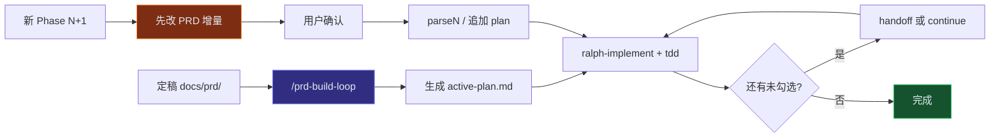

# Skills 安装说明

> GitHub 网络不稳定时，技能已**手动安装**到本地。网络恢复后可重新运行 `npx skills@latest add` 同步官方最新版。

## 已安装 — 全局 (`~/.agents/skills/`)

| Skill | 来源 |
| ----- | ---- |
| grill-me, grilling | mattpocock/skills |
| setup-matt-pocock-skills | mattpocock/skills |
| grill-with-docs | mattpocock/skills |
| to-prd | mattpocock/skills |
| to-issues | mattpocock/skills |
| tdd | mattpocock/skills |
| domain-modeling | mattpocock/skills |
| handoff | mattpocock/skills |
| ralph-init | tradesdontlie/ralph-loop-skills |
| ralph-implement | tradesdontlie/ralph-loop-skills |
| ralph-loop | tradesdontlie/ralph-loop-skills |

## 项目级编排 Skill（独立 GitHub 仓库）

| Skill | 安装源 |
| ----- | ------ |
| **prd-build-loop** + ralph-* | https://github.com/ballmaK/prd-build-loop-skills |

```bash
npx skills@latest add ballmaK/prd-build-loop-skills --agent cursor -y -g
```

或手动复制到目标项目：`.cursor/skills/prd-build-loop/`

## 网络恢复后同步命令

```bash
npx skills@latest add mattpocock/skills \
  --skill setup-matt-pocock-skills --skill grill-with-docs \
  --skill to-issues --skill tdd --skill domain-modeling \
  --skill to-prd --skill handoff --skill grilling --skill grill-me \
  --agent cursor -y -g

npx skills@latest add tradesdontlie/ralph-loop-skills --agent cursor -y -g
```

## 使用流程


