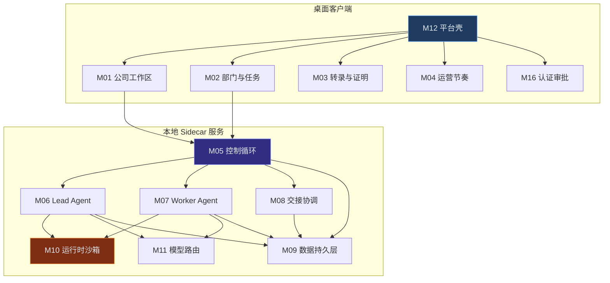
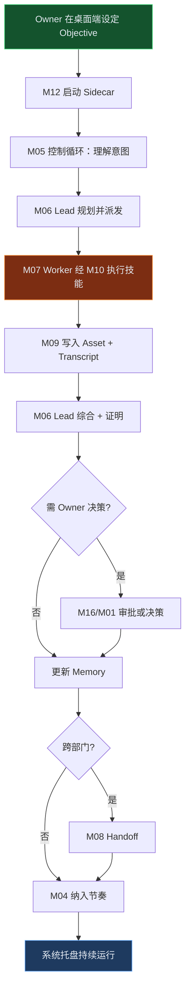

# 00 — 宏观共享 PRD

> **本文档为所有模块 PRD 的共享上游。** 模块文档仅展开本模块的中观/微观章节，宏观章节一律引用本文。

---

## 文档信息

| 项目 | 内容 |
| ---- | ---- |
| 项目名称 | Operon — 跨平台 0 人 Agent 公司桌面应用 |
| 文档版本 | v0.3 |
| 编写日期 | 2026-07-04 |
| 需求来源 | https://matrix.build/zh/guide |
| 模块索引 | [README.md](./README.md) |

---

## 一、业务背景

### 1.1 业务现状

Matrix 官方桌面版目前 **仅支持 macOS**。Windows 用户无法使用其「0 人 Agent 公司」运营模型。传统 AI 助手以单轮对话为主，缺乏部门边界、持久记忆、工作证明与跨会话连续性。

用户需要一款能在 **Windows 上原生运行**，并兼顾 macOS / Linux 的跨平台产品：设定 Objective 后，Lead/Worker 分层自主执行，Owner 通过复盘节奏做战略决策，工作以资产与证明收口。

### 1.2 业务目标

1. **Windows 优先交付**：在 Windows 10/11 上完整跑通 Matrix 指南定义的 8 种运营循环。
2. **跨平台一致体验**：同一套业务模型在 macOS、Linux 上行为一致，仅平台适配层不同。
3. **本地优先长任务**：Agent 运行在本地 Sidecar 进程，关闭窗口后任务不中断（系统托盘保活）。
4. **可信自动化**：转录审计 + 证明收口，对话不是最终产物。

### 1.3 预期收益

| 维度 | 预期 |
| ---- | ---- |
| 市场 | 覆盖 Windows 主力用户群（官方 Matrix 未覆盖） |
| 体验 | 本地文件/记忆可控，无浏览器标签依赖 |
| 效率 | 部门边界降低上下文噪声，Worker 失败不污染 Lead 记忆 |
| 扩展 | 模块化 PRD 支撑分团队并行开发与 AI 分模块编码 |

---

## 二、功能范围

### 2.1 功能边界

| 范围 | 包含 | 不包含 |
| ---- | ---- | ------ |
| **MVP（P0）** | Tauri 2 桌面壳、**纯本地**存储、多公司工作区（无数量限制）、Objective、部门/Lead/Worker、控制循环、**Docker 必选**代码沙箱 + Playwright、Handoff、运营节奏、Owner 审批、系统托盘后台 | OKR 树、云同步、官方 Neo Harness、无 Docker 降级、Agent Wallet |
| **P1** | **OKR 视图**、多模型配置 UI、证明墙增强、自动更新 | 自定义域名全自动 SSL |
| **P2** | 可选云同步、**多公司配额增值**、Stripe 收款、VPTD 看板、Agent 邮箱 | 企业 SSO、等保 |

### 2.2 功能优先级（全局）

| 优先级 | 功能 | 主责模块 |
| ------ | ---- | -------- |
| P0 | 跨平台桌面壳 + 本地服务 | M12 |
| P0 | 控制循环 | M05 |
| P0 | Lead / Worker / 记忆 | M06, M07, M09 |
| P0 | 技能 + 沙箱 | M10 |
| P0 | 公司/部门/任务 UI | M01, M02 |
| P0 | 转录 + 证明 | M03, M09 |
| P0 | Handoff | M08 |
| P0 | 运营节奏 | M04 |
| P0 | 认证 + 审批 | M16 |
| P1 | **OKR 视图**、模型路由 UI | M01、M05、M11 |
| P2 | 云同步、多公司增值配额、变现原语 | M01、M09 |

### 2.3 已确认产品决策

| 编号 | 决策 | PRD 约束 |
| ---- | ---- | -------- |
| C01 | Tauri 2 | 桌面壳与 Sidecar 按 Tauri 2 实现 |
| C02 | Docker 必选 | 未检测到 Docker 时禁止进入控制室 |
| C03 | MVP 纯本地 | 所有数据落盘 M09，无云端依赖 |
| C04 | 多公司增值后置 | MVP 不限公司数；P2 引入免费/Pro 配额 |
| C05 | OKR 放 P1 | MVP 控制循环仅围绕 Objective |

### 2.4 跨平台范围矩阵

| 能力 | Windows | macOS | Linux |
| ---- | ------- | ----- | ----- |
| 桌面应用（Tauri 2） | ✅ MVP | ✅ MVP | ✅ MVP |
| 系统托盘后台 | ✅ MVP | ✅ MVP | ✅ MVP |
| 本地 SQLite + 文件 | ✅ MVP 纯本地 | ✅ | ✅ |
| Playwright 浏览器 | ✅ MVP | ✅ MVP | ✅ MVP |
| Docker 代码沙箱 | ✅ **必选** Docker Desktop | ✅ **必选** | ✅ **必选** |
| 自动更新 | ✅ P1 | ✅ P1 | ⚠️ AppImage 手动 |

---

## 三、定位

- **目标用户**：Windows 创业者、独立开发者、小团队——想用 Agent 公司模型验证商业想法。
- **使用场景**：
  1. Windows 笔记本上设定 Objective，合上盖子前任务在托盘继续跑；
  2. 多部门协作产品发布，Engineering → Marketing Handoff；
  3. 每周一打开「运营节奏中心」做复盘决策；
  4. 一个月后回到定价项目，Lead 从本地 Memory.md 恢复上下文。
- **核心价值**：在 Windows 上也能**运营**一家 Agent 公司，而非**聊天**。

---

## 四、业务模块划分

### 4.1 模块总览



### 4.2 模块清单

| 编号 | 模块 | 端 | 核心职责 | 依赖 |
| ---- | ---- | -- | -------- | ---- |
| M12 | 平台壳 | 桌面 | Tauri 壳、Sidecar 启停、托盘、路径适配 | — |
| M16 | 认证审批 | 桌面+服务 | 本地用户、审批 gate | M12 |
| M09 | 数据持久层 | 服务 | SQLite + 本地文件系统 | M12 |
| M11 | 模型路由 | 服务 | LLM 选型与降级 | M12 |
| M10 | 运行时沙箱 | 服务 | 技能执行、Playwright、容器 | M12, M11 |
| M06 | Lead Agent | 服务 | 规划、派发、综合 | M09, M11 |
| M07 | Worker Agent | 服务 | 窄 brief 执行 | M10, M11 |
| M05 | 控制循环 | 服务 | 六阶段编排 | M06, M07, M08 |
| M08 | 交接协调 | 服务 | Handoff | M06, M09 |
| M01 | 公司工作区 | 桌面 UI | Objective 控制室 | M05, M16 |
| M02 | 部门与任务 | 桌面 UI | 部门、Task、实况 | M05, M07 |
| M03 | 转录与证明 | 桌面 UI | 时间线、证明墙 | M09 |
| M04 | 运营节奏 | 桌面 UI+调度 | 复盘、阻塞 | M05, M09 |

### 4.3 代码目录建议（AI 编码映射）

```
operon/
├── apps/
│   ├── desktop/          # M12 + M01~M04 + M16 UI（Tauri + React）
│   └── sidecar/          # M05~M11 本地 HTTP 服务（Rust/Node）
├── packages/
│   ├── shared-types/     # 跨模块实体类型
│   └── db/               # M09 Schema
└── docs/prd/             # 本 PRD 目录
```

---

## 五、业务链路图

### 5.1 端到端流转



### 5.2 链路说明

| 环节 | 触发 | 处理 | 输出 |
| ---- | ---- | ---- | ---- |
| 应用启动 | 用户打开桌面应用 | M12 启动 Sidecar（**Docker pass 后**），检查路径 | 就绪状态 |
| 设定目标 | Owner 输入 | M01 → M05 创建 Objective | 控制循环实例 |
| 规划派发 | 循环进入 PLAN | M06 读 Memory，创建 Task | Worker 任务入队 |
| 技能执行 | Worker 运行 | M10 Playwright/容器 | ToolTrace + Proof |
| 本地持久化 | 每步执行 | M09 写 SQLite + 文件 | 可恢复状态 |
| 后台续跑 | 用户关窗 | M12 托盘保活 Sidecar | 任务不中断 |
| 复盘 | 定时/手动 | M04 汇总阻塞 | RhythmReport |

---

## 十、业务场景（全局）

### 场景1：Windows 首次启动并创建公司

**前置条件**：已安装 Operon（MSI/EXE），Windows 10/11。

**操作流程**：
1. 用户双击桌面图标，M12 **强制检测 Docker Desktop 运行中**，并初始化 `%APPDATA%/operon/`。
2. Docker 未就绪则停留环境向导，不可跳过。
2. 创建向导（M01）输入公司名称与首个 Objective。
3. M12 启动 Sidecar，M05 启动控制循环。

**预期结果**：系统托盘显示运行中；公司工作区可见目标在顶部。

---

### 场景2：关窗后任务继续（Windows 托盘）

**前置条件**：Objective active，Worker 执行中。

**操作流程**：
1. 用户点击窗口关闭。
2. M12 最小化到托盘，Sidecar 继续运行。
3. 用户稍后从托盘「打开控制室」查看 M02 实况。

**预期结果**：Task 状态连续，无中断。

---

### 场景3：产品发布多部门协作

**前置条件**：Product / Research / Design 部门已创建。

**操作流程**：
1. Owner 向 Product Lead 下达方向（M01）。
2. M06 派发 Research、Design Worker（M07→M10）。
3. 产出 Asset 写入本地目录（M09），Transcript 可审计（M03）。

**预期结果**：全链路可在转录时间线回放。

---

### 场景4：Engineering → Marketing Handoff

见 [M08-handoff.md](./modules/M08-handoff.md) 场景。

---

### 场景5：周复盘与阻塞决策

见 [M04-rhythm.md](./modules/M04-rhythm.md) 场景。

---

### 场景6：一个月后记忆恢复

见 [M06-lead-agent.md](./modules/M06-lead-agent.md) 场景。

---

### 场景7：高风险技能审批

见 [M16-auth-approval.md](./modules/M16-auth-approval.md) 场景。

---

### 场景8：Docker 未就绪阻断

**前置条件**：未安装或未启动 Docker Desktop。

**操作流程**：
1. M12 环境检测 Docker 为 fail。
2. 首次启动向导展示安装/启动指引，**禁止进入控制室**。
3. 用户完成 Docker 启动后点击「重新检测」，通过后 Sidecar 方可启动。

**预期结果**：无 Docker 时不启动 M10 代码沙箱；避免半可用状态。

---

## 附录：全局实体索引

> 各实体字段清单在所属模块 PRD 中定义，此处仅索引。

| 实体 | 主责模块 |
| ---- | -------- |
| Company, Objective | M01 |
| Department, Task, AgentRun | M02 |
| Proof（展示） | M03 |
| RhythmReport, Blocker | M04 |
| ControlLoop | M05 |
| LeadAgent | M06 |
| WorkerAgent | M07 |
| Handoff | M08 |
| Transcript, Asset, Memory | M09 |
| Skill, SkillInvocation, SandboxSession | M10 |
| ModelConfig | M11 |
| User, Approval | M16 |
| AppConfig, SidecarStatus | M12 |

---

## 修订记录

| 版本 | 日期 | 修改内容 |
| ---- | ---- | -------- |
| v0.3 | 2026-07-04 | 确认 C01~C05：Tauri2、Docker必选、纯本地、多公司增值后置、OKR放P1 |
| v0.2 | 2026-07-04 | 拆分为宏观共享；定位改为 Windows 优先跨平台桌面版 |
| v0.1 | 2026-07-04 | 单体 Web 版 PRD（已废弃） |
