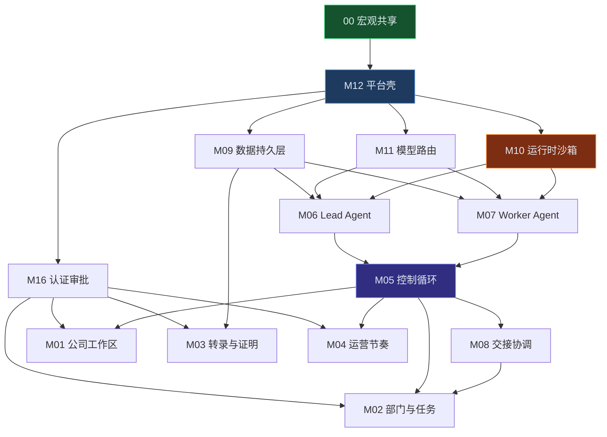

# Operon — 模块化 PRD 索引

> 产品定位：**Windows 优先、跨平台（Windows / macOS / Linux）** 的 0 人 Agent 公司桌面应用 **Operon**。  
> 需求来源：[Matrix 用户指南](https://matrix.build/zh/guide)（Operon 为独立实现，非官方 Matrix 产品）

---

## 文档体系

采用 **宏观共享 + 模块独立** 拆分，便于 AI 分模块编码、并行开发与独立评审。

| 文档 | 路径 | 层级 | 说明 |
| ---- | ---- | ---- | ---- |
| **宏观共享** | [00-macro-shared.md](./00-macro-shared.md) | 宏观 | 业务背景、功能范围、全模块划分、业务链路、8 大场景 |
| **M12 平台壳** | [modules/M12-platform-shell.md](./modules/M12-platform-shell.md) | 中观+微观 | Tauri 桌面壳、安装更新、本地服务、系统托盘 |
| **M16 认证审批** | [modules/M16-auth-approval.md](./modules/M16-auth-approval.md) | 中观+微观 | 用户认证、Owner 审批 gate、API Key 管理 |
| **M01 公司工作区** | [modules/M01-company-workspace.md](./modules/M01-company-workspace.md) | 中观+微观 | 公司控制台、Objective、创建向导 |
| **M02 部门与任务** | [modules/M02-department-task.md](./modules/M02-department-task.md) | 中观+微观 | 部门管理、Task、执行实况 |
| **M03 转录与证明** | [modules/M03-transcript-proof.md](./modules/M03-transcript-proof.md) | 中观+微观 | 转录时间线、证明墙、资产库 UI |
| **M04 运营节奏** | [modules/M04-rhythm.md](./modules/M04-rhythm.md) | 中观+微观 | 日复盘/周复盘、阻塞、节奏调度 |
| **M05 控制循环** | [modules/M05-control-loop.md](./modules/M05-control-loop.md) | 中观 | 编排核心：理解→规划→派发→证据→综合→决策 |
| **M06 Lead Agent** | [modules/M06-lead-agent.md](./modules/M06-lead-agent.md) | 中观 | Lead 规划、派发、综合、Memory 读写 |
| **M07 Worker Agent** | [modules/M07-worker-agent.md](./modules/M07-worker-agent.md) | 中观 | Worker 窄 brief 执行、证明提交 |
| **M08 交接协调** | [modules/M08-handoff.md](./modules/M08-handoff.md) | 中观 | 跨 Lead 结构化 Handoff |
| **M09 数据持久层** | [modules/M09-data-persistence.md](./modules/M09-data-persistence.md) | 中观 | Transcript、Asset、Memory 本地存储 |
| **M10 运行时沙箱** | [modules/M10-runtime-sandbox.md](./modules/M10-runtime-sandbox.md) | 中观 | 技能执行、跨平台沙箱、浏览器自动化 |
| **M11 模型路由** | [modules/M11-model-router.md](./modules/M11-model-router.md) | 中观 | 多模型按角色/任务路由 |

---

## 模块依赖图



---

## 推荐阅读与开发顺序

| 阶段 | 模块 | 理由 |
| ---- | ---- | ---- |
| Phase 0 | 00 → M12 → M16 → M09 | 桌面能跑起来、有本地存储和登录 |
| Phase 1 | M11 → M10 → M07 → M06 → M05 | 单 Objective 控制循环闭环 |
| Phase 2 | M01 → M02 → M03 | 核心 UI 可观测 |
| Phase 3 | M08 → M04 | 多部门协作与运营节奏 |
| **Phase 4** | M16 → M10 → M01 → M11 → M03 → M12 | MVP 补齐（审批/沙箱）+ P1（OKR/模型 UI/证明墙/自动更新） |

---

## 跨平台技术约束（全局）

| 平台 | 桌面壳 | 沙箱 | 文件存储 | 后台长任务 |
| ---- | ------ | ---- | -------- | ---------- |
| **Windows 10/11** | Tauri 2（已确认） | Docker Desktop **必选** | `%APPDATA%/operon/`（纯本地） | 系统托盘 + 本地 Sidecar 进程 |
| **macOS 13+** | Tauri 2 | Docker Desktop | `~/Library/Application Support/operon/` | 同上 |
| **Linux** | Tauri 2 | Docker | `~/.local/share/operon/` | 同上 |

> 旧版单体 PRD [`../Matrix-Web-PRD.md`](../Matrix-Web-PRD.md) 已 superseded，请以本目录为准。

---

## 已确认产品决策（2026-07-04）

| 编号 | 决策 | 影响 |
| ---- | ---- | ---- |
| **C01** | 桌面壳采用 **Tauri 2** | M12 |
| **C02** | **Docker Desktop 必选**（MVP 无降级路径） | M10、M12 |
| **C03** | **MVP 纯本地**存储；云同步放 P2 | M09、M12 |
| **C04** | MVP **不限制**公司数量；多公司配额作为**增值服务**后续考虑 | M01 |
| **C05** | **OKR 树放 P1**；MVP 仅 Objective | M01、M05 |

---

## PRD 定稿后自动实现

宏观+模块 PRD 确认后，在 Cursor Agent 运行：

```
/prd-build-loop
```

详见 [docs/SKILLS.md](../SKILLS.md)。
