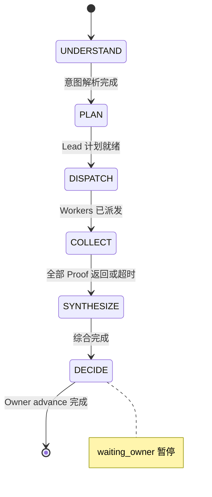

# M05 — 控制循环引擎

> **宏观章节引用**：[00-macro-shared.md](../00-macro-shared.md)  
> **依赖**：M06、M07、M08、M09 | **被依赖**：M01、M02、M04

---

## 文档信息

| 模块编号 | M05 |
| 模块名称 | 控制循环引擎 |
| 版本 | v0.3 |
| 备注 | OKR 拆解为 **P1**（C05）；MVP 仅 Objective 驱动；**Phase 5**：decide 暂停已实现 |
| 优先级 | P0 |

---

## 模块职责

将每个 Owner 请求变为可重复六阶段闭环：

**理解意图 → 规划工作 → 派发 Workers → 收集证据 → 综合结果 → 请求决策**

---

## 六、数据流图

---

## 七、实体

### ControlLoop

| 属性 | 说明 |
| ---- | ---- |
| id | UUID |
| objectiveId | 关联目标 |
| phase | 六阶段枚举 |
| status | running/waiting_owner/completed/error |
| iteration | 循环轮次 |

---

## 八、字段清单 — ControlLoop

| 所属模块 | 字段名称 | 字段来源 | 取值说明 | 必填性 | 详情展示 | 字段说明 |
| -------- | -------- | -------- | -------- | ------ | -------- | -------- |
| 控制循环 | 循环ID | 系统生成 | UUID | 必填 | 是 | |
| 控制循环 | 当前阶段 | 系统生成 | understand/plan/dispatch/collect/synthesize/decide | 必填 | 是 | |
| 控制循环 | 循环状态 | 系统生成 | running/waiting_owner/completed/error | 必填 | 是 | |
| 控制循环 | 轮次 | 系统生成 | 整数 ≥1 | 必填 | 是 | |
| 控制循环 | 等待原因 | 系统生成 | 文本 | 选填 | 是 | 阻塞/审批 |

---

## 九、状态机

### ControlLoop.status

| 状态 | 说明 | 终态 |
| ---- | ---- | ---- |
| CL_RUNNING | 阶段推进中 | 否 |
| CL_WAITING_OWNER | 等待 Owner | 否 |
| CL_COMPLETED | 本循环结束 | 是 |
| CL_ERROR | 不可恢复错误 | 是 |

### 阶段推进规则

| 阶段 | 负责模块 | 退出条件 |
| ---- | -------- | -------- |
| UNDERSTAND | M05 | 意图+约束+附件解析完成 |
| PLAN | M06 | 计划与 Task 列表生成 |
| DISPATCH | M06→M07 | 全部 Task 入队 |
| COLLECT | M07→M09 | 全部 Task 终态或超时 |
| SYNTHESIZE | M06 | Lead 综合报告生成 |
| DECIDE | M01 Owner | 有 Blocker/Approval 则进入，否则回 PLAN |

---

## 十一、核心规则

| 编号 | 描述 | 违反处理 |
| ---- | ---- | -------- |
| CL-01 | 同一 Objective 同时仅 1 个 running **或** waiting_owner | 拒绝启动（CL-01） |
| CL-02 | COLLECT 阶段最长等待 24h [待确认] | 超时标记 Task FAILED |
| CL-03 | 每阶段切换写 Transcript | 自动 |
| CL-04 | Owner 决策超时 7 天提醒 | M04 通知 |

---

## 十二、动作权限

| 动作 | Owner | Lead(System) |
| ---- | ----- | ------------ |
| ACT_START_LOOP | ✅ | ❌ |
| ACT_PAUSE_LOOP | ✅ | ❌ |
| ACT_ADVANCE_PHASE | ❌ | ✅ 自动 |
| ACT_MARK_BLOCKED | ❌ | ✅ |

---

## 接口契约

| 方法 | 路径 | 说明 |
| ---- | ---- | ---- |
| POST | /api/v1/objectives/{id}/loop/start | 启动循环（async，结束时 `waiting_owner`） |
| GET | /api/v1/objectives/{id}/loop | 当前状态 |
| POST | /api/v1/control-loops/{id}/advance | Owner 确认 decide，置 `completed` |
| POST | /api/v1/objectives/{id}/loop/pause | 暂停（待实现） |

---

## 实现状态（Phase 5）

| 能力 | 状态 | 代码位置 |
| ---- | ---- | -------- |
| 六阶段自动推进 understand→synthesize | ✅ | `packages/db/src/services/control-loop-service.ts` |
| decide 阶段 `waiting_owner` 暂停 | ✅ | 同上 `runPipeline` |
| `POST .../advance` 完成循环 | ✅ | `apps/sidecar/src/routes/control-loops.ts` |
| CL-01 含 waiting_owner 互斥 | ✅ | `control-loop-repo.findRunningByObjective` |
| KeyResult rollup（P1） | ✅ | Phase 4 |
| loop/pause API | ⏳ | 未实现 |

---

## 跨平台说明

- 循环状态持久化在 M09 SQLite，Sidecar 重启后从 COLLECT 阶段恢复。
