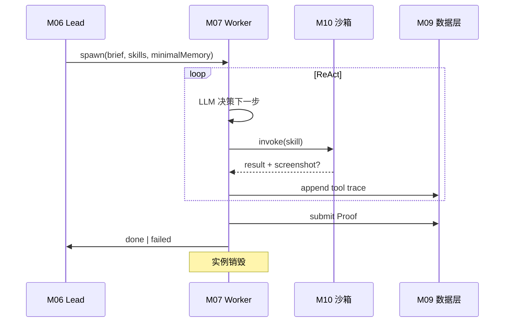

# M07 — Worker Agent 服务

> **宏观章节引用**：[00-macro-shared.md](../00-macro-shared.md)  
> **依赖**：M10、M11、M09、M16 | **被依赖**：M05、M02

---

## 文档信息

| 模块编号 | M07 |
| 模块名称 | Worker Agent 服务 |
| 版本 | v0.1 |
| 优先级 | P0 |

---

## 模块职责

1. **一次性 Agent**：窄 brief 启动，完成后实例销毁。
2. **ReAct 循环**：调用 M10 技能直到 Proof 满足或失败。
3. **隔离**：不加载 Lead 全量 Memory，不污染部门上下文。
4. **证据提交**：文件/截图/URL 写入 M09，ToolTrace 写 Transcript。

---

## 八、字段清单 — WorkerAgent

| 所属模块 | 字段名称 | 字段来源 | 取值说明 | 字段说明 |
| -------- | -------- | -------- | -------- | -------- |
| Worker | 实例ID | 系统生成 | UUID | 用完即毁 |
| Worker | 关联任务ID | 系统生成 | Task.id | |
| Worker | 窄简报 | 系统生成 | ≤3000 字符 | 唯一上下文 |
| Worker | 最小记忆片段 | 系统生成 | ≤2KB | LE-01 |
| Worker | 实例状态 | 系统生成 | spawning/running/done/failed | |

---

## 九、状态机 — WorkerAgent

| 当前 | 目标 | 条件 |
| ---- | ---- | ---- |
| WRK_SPAWNING | WRK_RUNNING | 沙箱就绪 |
| WRK_RUNNING | WRK_DONE | Proof 提交成功 |
| WRK_RUNNING | WRK_FAILED | 超时/错误/审批拒绝 |

---

## 十一、核心规则

| 编号 | 描述 | 违反处理 |
| ---- | ---- | -------- |
| WK-01 | 仅 allowedSkills 可调用 | 拦截 SK-01 |
| WK-02 | 默认超时 30min [待确认] | TSK_FAILED |
| WK-03 | 完成后必须销毁进程/容器 | 自动回收 |
| WK-04 | 失败时 Lead 记忆不写入错误堆栈 | 仅 Transcript |

---

## 执行流程

---

## 接口契约

| 方法 | 路径 | 说明 |
| ---- | ---- | ---- |
| POST | /internal/workers/spawn | M06 调用 |
| GET | /internal/workers/{id}/status | 状态 |
| POST | /internal/workers/{id}/cancel | 取消 |

---

## 跨平台说明

- Worker 进程优先级：Windows `BELOW_NORMAL`，避免抢用户前台性能。
