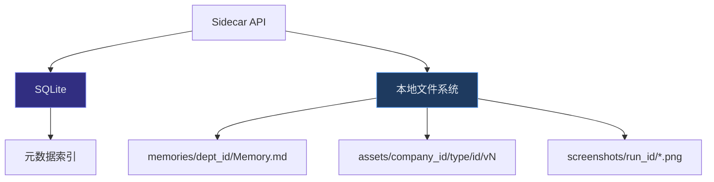

# M09 — 数据持久层

> **宏观章节引用**：[00-macro-shared.md](../00-macro-shared.md)  
> **依赖**：M12 | **被依赖**：M03~M08、M10

---

## 文档信息

| 模块编号 | M09 |
| 模块名称 | 数据持久层 |
| 版本 | v0.2 |
| 备注 | **MVP 纯本地**（C03）；云同步 P2 |
| 优先级 | P0 |

---

## 模块职责

1. **SQLite**：结构化实体（Company、Task、Handoff 等）。
2. **本地文件系统**：Asset 二进制、Memory.md、截图。
3. **追加式 Transcript**：审计日志不可删。
4. **跨平台路径**：统一通过 M12 DATA_DIR 解析。
5. **MVP 纯本地**：无云端同步接口（C03）；云同步 P2 另立模块。

---

## 六、存储架构



### 目录结构（跨平台逻辑路径）

```
{DATA_DIR}/
├── matrix.db                 # SQLite
├── companies/{companyId}/
│   ├── assets/{assetId}/v{n}/
│   ├── memories/{deptId}/Memory.md
│   └── screenshots/{runId}/
└── logs/
```

---

## 八、字段清单 — Transcript（权威存储）

| 所属模块 | 字段名称 | 字段来源 | 取值说明 | 必填性 | 字段说明 |
| -------- | -------- | -------- | -------- | ------ | -------- |
| 数据层 | 转录ID | 系统生成 | UUID | 必填 | |
| 数据层 | 公司ID | 系统生成 | UUID | 必填 | 租户隔离 |
| 数据层 | 行为主体 | 系统生成 | owner/lead/worker/system | 必填 | |
| 数据层 | 行为类型 | 系统生成 | input/plan/dispatch/tool/proof/synthesis/decision/handoff | 必填 | |
| 数据层 | 载荷JSON | 系统生成 | JSON | 必填 | |
| 数据层 | 关联实体 | 系统生成 | type+id | 选填 | |
| 数据层 | 时间戳 | 系统生成 | ISO8601 | 必填 | 只追加 |

## 八、字段清单 — Asset（权威存储）

| 所属模块 | 字段名称 | 字段来源 | 取值说明 | 必填性 | 字段说明 |
| -------- | -------- | -------- | -------- | ------ | -------- |
| 数据层 | 资产ID | 系统生成 | UUID | 必填 | |
| 数据层 | 资产名称 | 系统/用户 | 2-120 字符 | 必填 | |
| 数据层 | 资产类型 | 系统生成 | report/spec/code/... | 必填 | |
| 数据层 | 版本号 | 系统生成 | 整数 | 必填 | 同 name+type 递增 |
| 数据层 | 存储相对路径 | 系统生成 | 相对 DATA_DIR | 必填 | 禁止绝对路径入库 |
| 数据层 | 校验和 | 系统生成 | SHA256 | 必填 | 完整性 |

## 八、字段清单 — Memory

| 所属模块 | 字段名称 | 字段来源 | 取值说明 | 必填性 | 字段说明 |
| -------- | -------- | -------- | -------- | ------ | -------- |
| 数据层 | 部门ID | 系统生成 | UUID | 必填 | 1:1 文件 |
| 数据层 | 文件路径 | 系统生成 | memories/{deptId}/Memory.md | 必填 | |
| 数据层 | 版本 | 系统生成 | 整数 | 必填 | 写前备份 v{n} |

---

## 十一、核心规则

| 编号 | 描述 |
| ---- | ---- |
| DP-01 | 所有表带 company_id，查询必须过滤 |
| DP-02 | Transcript DELETE 禁止，仅 INSERT |
| DP-03 | Memory 写入前备份到 `Memory.md.bak.{version}` |
| DP-04 | Windows 路径入库一律相对路径 |
| DR-DP-01 | SQLite WAL 模式开启 |

---

## 十一、异常

| 编码 | 处理 |
| ---- | ---- |
| E-DP-01 | 磁盘不足 <500MB | 暂停新 Worker，通知 Owner |
| E-DP-02 | DB 锁冲突 | 重试 3 次 |

---

## 接口契约（内部 Repository）

| Repo | 方法 |
| ---- | ---- |
| TranscriptRepo | append, query(page) |
| AssetRepo | create, get, list, resolvePath |
| MemoryRepo | read, writeWithBackup |
| CompanyRepo | CRUD + 事务 |

---

## 跨平台说明

| 平台 | SQLite | 文件锁 |
| ---- | ------ | ------ |
| Windows | 正常 | 注意 OneDrive 同步目录避让 |
| macOS | 正常 | |
| Linux | 正常 | |

> **建议**：检测 DATA_DIR 位于云同步文件夹时警告用户（Windows OneDrive/Desktop）。
