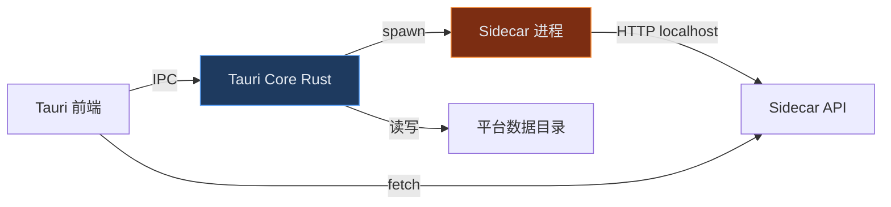
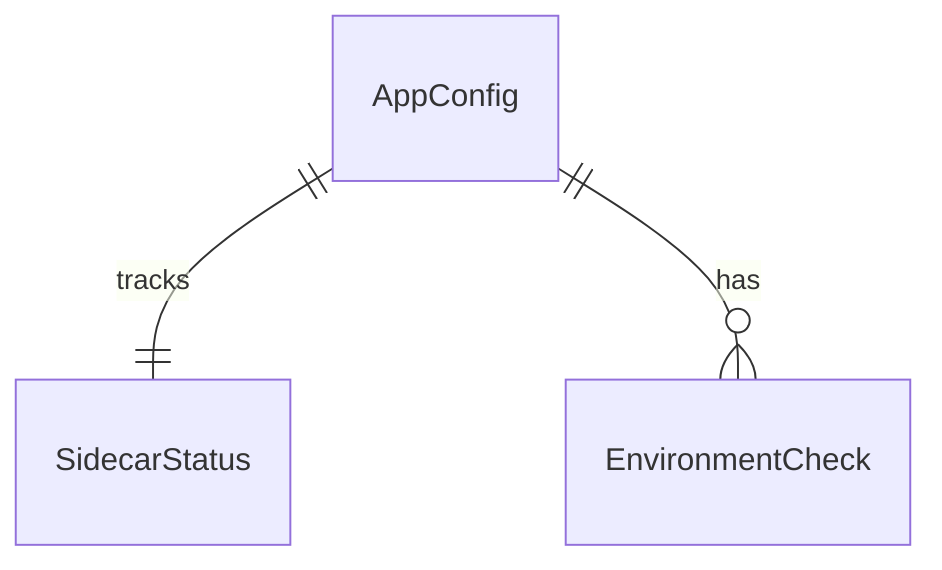

# M12 — 平台壳（跨平台桌面基础）

> **宏观章节引用**：[00-macro-shared.md](../00-macro-shared.md)  
> **下游依赖方**：M16、M09、M05~M11、M01~M04

---

## 文档信息

| 项目 | 内容 |
| ---- | ---- |
| 模块编号 | M12 |
| 模块名称 | 平台壳 / Platform Shell |
| 版本 | v0.2 |
| 端 | 桌面客户端（**Tauri 2**，C01 已确认） |
| 优先级 | P0 |

---

## 模块职责

1. 提供 Windows / macOS / Linux 统一桌面壳。
2. 管理本地 Sidecar 服务进程启停与健康检查。
3. 系统托盘：关窗后续跑、状态展示、快捷打开控制室。
4. 跨平台路径适配（数据目录、日志目录、临时目录）。
5. 首次启动**强制**环境检测（**Docker 必选**、Playwright 浏览器、磁盘空间）。

---

## 六、数据流图（本模块）

### 数据流清单

| 编号 | 名称 | 生产方 | 消费方 | 方式 | 内容 |
| ---- | ---- | ------ | ------ | ---- | ---- |
| DF-M12-01 | Sidecar 启停 | Tauri Core | Sidecar | 进程信号 | port, dataDir |
| DF-M12-02 | 健康检查 | Sidecar | Tauri UI | HTTP GET /health | status, version |
| DF-M12-03 | 托盘事件 | 用户 | Tauri Core | 系统 API | show/hide/quit |

### 数据存储

| 路径变量 | Windows | macOS | Linux |
| -------- | ------- | ----- | ----- |
| DATA_DIR | `%APPDATA%/operon` | `~/Library/Application Support/operon` | `~/.local/share/operon` |
| LOG_DIR | `%APPDATA%/operon/logs` | 同上/logs | 同上/logs |
| TEMP_DIR | `%TEMP%/operon` | `$TMPDIR/operon` | `/tmp/operon` |

---

## 七、实体关系（本模块）

| 实体 | 说明 |
| ---- | ---- |
| AppConfig | 应用级配置（端口、语言、主题） |
| SidecarStatus | Sidecar 运行状态 |
| EnvironmentCheck | 环境检测结果 |

---

## 八、字段清单

### AppConfig

| 所属模块 | 字段名称 | 字段来源 | 取值说明 | 必填性 | 新增页 | 编辑页 | 列表展示 | 可筛选 | 详情展示 | 字段说明 | 备注 |
| -------- | -------- | -------- | -------- | ------ | ------ | ------ | -------- | ------ | -------- | -------- | ---- |
| 平台壳 | 数据目录 | 系统生成 | 平台绝对路径 | 必填 | 只读 | 只读 | 否 | 否 | 是 | 本地根目录 | 跨平台 |
| 平台壳 | Sidecar 端口 | 系统生成 | 1024-65535，默认 3721 | 必填 | 只读 | 可编辑 | 否 | 否 | 是 | 本地 API 端口 | DR-M12-01 |
| 平台壳 | 开机自启 | 用户填写 | 布尔，默认 false | 选填 | 可编辑 | 可编辑 | 否 | 否 | 是 | 系统启动项 | Windows 注册表 |
| 平台壳 | 关窗行为 | 用户填写 | 枚举：tray/quit | 必填 | 可编辑 | 可编辑 | 否 | 否 | 是 | 默认 tray | |
| 平台壳 | 界面语言 | 用户填写 | zh-CN/en-US | 选填 | 可编辑 | 可编辑 | 否 | 否 | 是 | i18n | |
| 平台壳 | 主题 | 用户填写 | light/dark/system | 选填 | 可编辑 | 可编辑 | 否 | 否 | 是 | 暗黑默认 | |

### SidecarStatus

| 所属模块 | 字段名称 | 字段来源 | 取值说明 | 必填性 | 新增页 | 编辑页 | 列表展示 | 可筛选 | 详情展示 | 字段说明 | 备注 |
| -------- | -------- | -------- | -------- | ------ | ------ | ------ | -------- | ------ | -------- | -------- | ---- |
| 平台壳 | 运行状态 | 系统生成 | stopped/starting/running/error | 必填 | 不展示 | 只读 | 是 | 多选 | 是 | Sidecar 状态 | |
| 平台壳 | 进程 ID | 系统生成 | 整数 | 选填 | 不展示 | 只读 | 否 | 否 | 是 | OS 进程号 | |
| 平台壳 | 最近心跳 | 系统生成 | ISO8601 | 必填 | 不展示 | 只读 | 是 | 否 | 是 | 健康检查 | |
| 平台壳 | 错误信息 | 系统生成 | 文本 | 选填 | 不展示 | 只读 | 否 | 否 | 是 | 启动失败原因 | |

### EnvironmentCheck

| 所属模块 | 字段名称 | 字段来源 | 取值说明 | 必填性 | 新增页 | 编辑页 | 列表展示 | 可筛选 | 详情展示 | 字段说明 | 备注 |
| -------- | -------- | -------- | -------- | ------ | ------ | ------ | -------- | ------ | -------- | -------- | ---- |
| 平台壳 | 检测项 | 系统生成 | docker/playwright/disk/memory | 必填 | 不展示 | 只读 | 是 | 多选 | 是 | 环境项 | |
| 平台壳 | 检测结果 | 系统生成 | pass/warn/fail | 必填 | 不展示 | 只读 | 是 | 多选 | 是 | | |
| 平台壳 | 建议操作 | 系统生成 | 文本 | 选填 | 不展示 | 只读 | 否 | 否 | 是 | 如「安装 Docker Desktop」 | |

---

## 九、状态机

### SidecarStatus

| 状态码 | 名称 | 终态 |
| ------ | ---- | ---- |
| SC_STOPPED | 已停止 | 否 |
| SC_STARTING | 启动中 | 否 |
| SC_RUNNING | 运行中 | 否 |
| SC_ERROR | 异常 | 否 |

| 当前 | 目标 | 动作 | 条件 |
| ---- | ---- | ---- | ---- |
| SC_STOPPED | SC_STARTING | ACT_START_SIDECAR | 数据目录可写 |
| SC_STARTING | SC_RUNNING | — | /health 200 |
| SC_STARTING | SC_ERROR | — | 超时 30s 或进程退出 |
| SC_RUNNING | SC_STOPPED | ACT_STOP_SIDECAR | 用户退出应用 |
| SC_ERROR | SC_STARTING | ACT_RETRY | 用户重试 |

---

## 十一、核心规则

### 11.1 业务规则

| 编号 | 名称 | 描述 | 违反处理 |
| ---- | ---- | ---- | -------- |
| PL-01 | 关窗默认最小化托盘 | 关窗行为默认 tray | 首次启动引导 |
| PL-02 | Sidecar 先于 UI 加载 | 进入控制室前 Sidecar 须 running | 展示启动页 |
| PL-02a | Docker 必选（C02） | Docker 检测 fail 时禁止启动 Sidecar | 停留环境向导 |
| PL-03 | 端口冲突自动递增 | 3721 占用则 +1 重试 | 写入 AppConfig |
| PL-04 | Windows 路径禁止硬编码 | 一律用 dirs crate / API | 代码审查 |

### 11.4 异常

| 编码 | 名称 | 处理 |
| ---- | ---- | ---- |
| E-M12-01 | Sidecar 启动超时 | 展示错误 + 重试 + 打开日志目录 |
| E-M12-02 | 数据目录无写权限 | 引导更换目录或以管理员运行 |
| E-M12-03 | Docker 未安装或未运行 | 阻断启动；展示安装/启动 Docker Desktop 指引 |

---

## 十二、动作权限

| 动作 | Owner | 条件 |
| ---- | ----- | ---- |
| ACT_START_SIDECAR | ✅ | SC_STOPPED/SC_ERROR 且 **Docker pass** |
| ACT_STOP_SIDECAR | ✅ | 退出应用时 |
| ACT_OPEN_LOG_DIR | ✅ | 任意 |
| ACT_ENV_RECHECK | ✅ | 任意 |

---

## 十四、页面规格

### P-M12-01 首次启动向导

**布局**：环境检测列表（**Docker 为硬性 pass**）→ 缺失项安装指引 → 确认数据目录 → 完成。  
**规则**：Docker 未 pass 时「进入应用」按钮禁用。

### P-M12-02 系统托盘菜单

| 菜单项 | 行为 |
| ------ | ---- |
| 打开控制室 | 显示主窗口 |
| Sidecar 状态 | 只读展示 |
| 暂停所有任务 | 调用 M05 API |
| 退出 | 停止 Sidecar 并退出 |

---

## 十五、非功能需求（本模块）

| 指标 | 要求 |
| ---- | ---- |
| 冷启动 | Windows P95 ≤ 5s（含 Sidecar） |
| 安装包 | Windows MSI/EXE ≤ 150MB [待确认] |
| 内存占用 | 空载 ≤ 200MB（不含 Sidecar） |
| 签名 | Windows Authenticode [P1] |

---

## 接口契约（概要）

| 方法 | 路径 | 说明 |
| ---- | ---- | ---- |
| GET | /health | Sidecar 健康 |
| GET | /api/v1/app/config | 读 AppConfig |
| PUT | /api/v1/app/config | 更新配置 |
| GET | /api/v1/app/environment | 环境检测结果 |

---

## 跨平台实现要点

| 平台 | 托盘 | Sidecar 启动 | 注意 |
| ---- | ---- | ------------ | ---- |
| Windows | `tray-icon` | `cmd /c` 或直接 exe | 防火墙首次弹窗 |
| macOS | NSStatusBar | unix spawn | 公证 notarization |
| Linux | AppIndicator | unix spawn | 桌面环境差异 |
