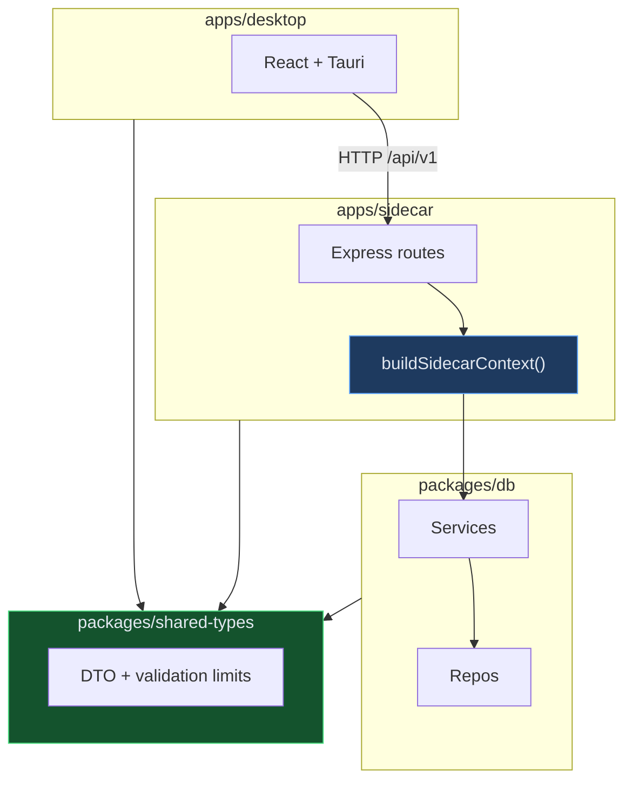

# Architecture Review — Operon

> Generated by improve-codebase-architecture pass (2026-07-05)

## Layering (preserved)

## Changes applied

| Issue | Fix |
| ----- | --- |
| Dual DI graph in `app.ts` + `buildOperonServices` | Single `buildSidecarContext()` composition root |
| `DepartmentWithStats` duplicate | Use `DepartmentSummary` from shared-types |
| Client-side approval filter | `GET /approvals?status=pending` |
| Validation constants duplicated | `shared-types/validation-limits.ts` |
| `test-fixtures` in production barrel | `@operon/db/testing` subpath export |

## Remaining opportunities (not in scope)

1. **ControlRoom god component** — split tab-level hooks or add react-query
2. **N+1 objective loop fetches** — bulk `control-room-summary` API
3. **HTTP auth** — localhost token for M16 Owner enforcement
4. **proof-query.ts** — fold into ProofRepo for consistent data access

## Conventions to keep

- Route factories with explicit deps interfaces (`companiesRouter(deps)`)
- `/api/v1` (UI) vs `/internal` (agents) split
- Transcript append on business actions
- SQL versioned migrations in `packages/db/src/migrations/`
